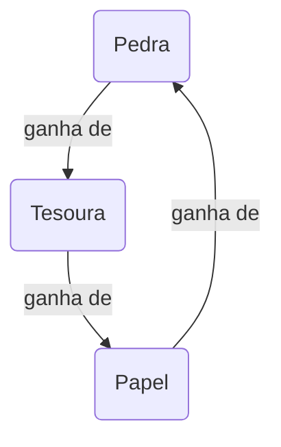

Pedra, papel e tesoura é um clássico, portanto imagino que você já deva ter jogado em algum momento. Mas não custa nada relembrar, a regra é simples: pedra ganha da tesoura, tesoura ganha do papel e papel ganha da pedra (para mais informações, veja [Wikipédia](https://pt.wikipedia.org/wiki/Pedra,_papel_e_tesoura)).



Do ponto de vista computacional, esse é um belo exercício para praticar.

{}
Dica: A função [choise](https://docs.python.org/3/library/random.html#random.choice) do módulo [random](https://docs.python.org/3/library/random.html) é uma boa opção para que o computador escolha aleatoriamente a sua jogada dentre as possibilidades pré estabelecidas em uma lista.
{}

Claro que existem vários caminhos diferentes para resolver um dado problema, para esse desafio não seria diferente. A cada problemas que resolvemos, agregamos experiência para abordar o seguinte.

**Dedique aqui algum tempo para produzir a sua própria solução.**

Apenas então prossiga para a células de código abaixo para ver a minha versão do jogo:

```python
# Importamos a função choice, que fará o papel do nosso adversário
from random import choice

# Lista das jogadas válidas

play = ["pedra", "papel", "tesoura"]

# Matriz de decisão do resultado, contendo as regras do jogo
rule = (("e", "d", "v"), ("v", "e", "d"), ("d", "v", "e"))

# Texto a ser exibido na tela para cada resultado possível
text = {
    "e": "    Empatou!",
    "v": "    Parabéns, você venceu!",
    "d": "    Você foi derrotado!",
}

# Aqui temos o jogo propriamente dito
while True:
    h, c = input("Faça a sua jogada: ").lower(), choice(play)

    if h == "sair":  # É sempre uma boa prática ter uma saída de um laço while True
        break

    if h in play:  # E um teste de que a jogada foi válida
        print(f"  O computador jogou {c}")
        print(text[rule[play.index(h)][play.index(c)]])
    else:
        print(f"  As jogadas válidas são:\n {play}")
```

E aqui vemos o jogo em ação:

```text
Faça a sua jogada:  pedra
    O computador jogou pedra
    Empatou!
Faça a sua jogada:  Papel
    O computador jogou papel
    Empatou!
Faça a sua jogada:  TESOURA
    O computador jogou papel
    Parabéns, você venceu!
Faça a sua jogada:  SaIR
```

Muitas vezes nos deparamos com a tarefa de ter que desvendar o código escrito por outra pessoa, e esse é o segundo passo desse desafio. Você consegue compreender como se dá o jogo no bloco acima? Se a resposta for não, recomendo a leitura sobre as estruturas de dados em Python chamadas [dicionários](https://docs.python.org/3/tutorial/datastructures.html#dictionaries), além de algumas [cláusulas de controle de laços](https://docs.python.org/3/tutorial/controlflow.html#break-and-continue-statements-and-else-clauses-on-loops).
