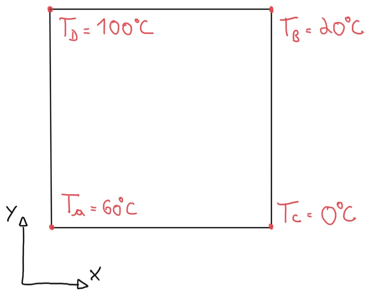
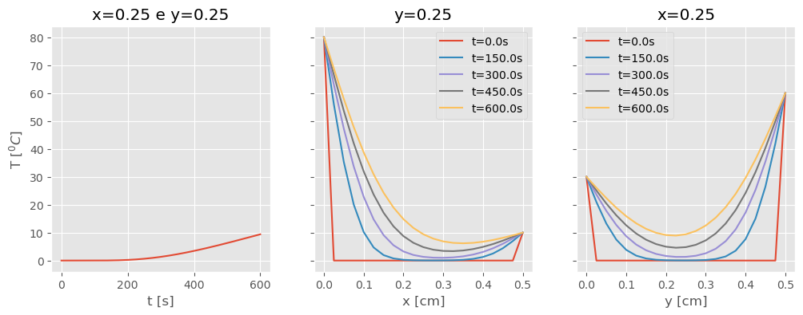
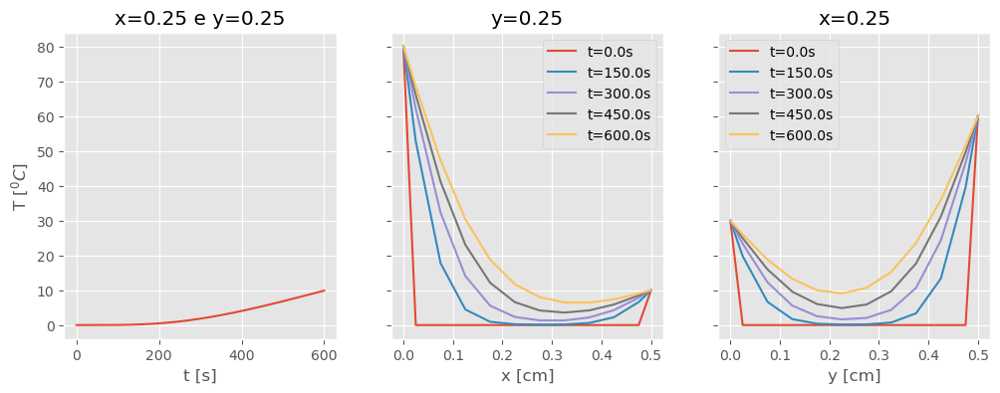
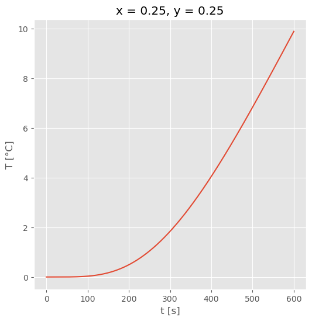
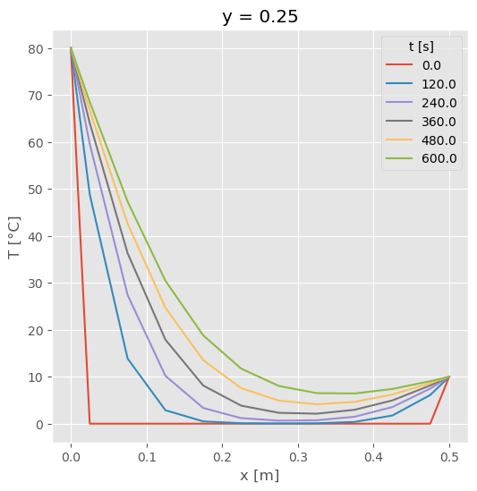
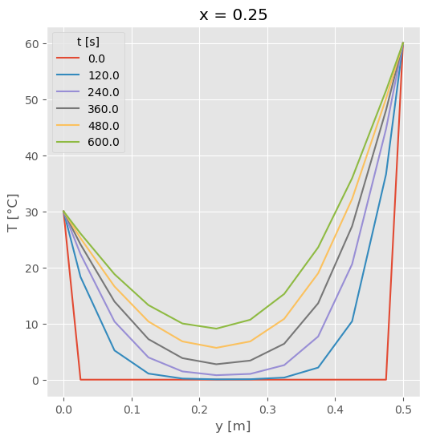
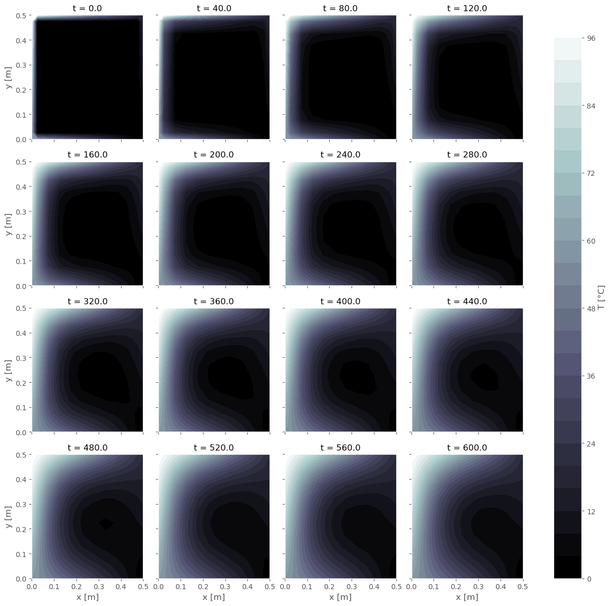

{}

## Introdução

O estudo de caso apresentado aqui, a condução de calor transiente em uma placa bidimensional, tem um papel interessante, pois ele não é exatamente o objetivo deste texto, mas sim um meio.
Deixe-me explicar, dia desses me deparei com [Xarray](http://xarray.pydata.org/en/stable/) (formalmente *xray*), pacote Python que se destina a tornar o trabalho com arranjos de dados multidimensionais uma tarefa simples, eficiente e divertida.

**Xarray** introduz rótulos na forma de dimensões, coordenadas e atributos sobre os dados brutos dos arranjos em formato [NumPy](https://numpy.org/), permitindo uma experiência de desenvolvimento mais intuitiva, consistente e a prova de falhas.

Após ler a [documentação oficial](http://xarray.pydata.org/en/stable/), fiquei empolgado para ver como esse pacote funciona na prática, e fico feliz em compartilhar essa experiência com você.
Aqui entra o estudo da condução de calor transiente bidimensional, que será descrito a seguir.
Logo após, o problema será resolvido com estruturas de dados **NumPy**, para contextualizar o leitor com três abordagens diferentes, e então, o mesmo problema será resolvido com **Xarray** para comparação.


```python
# Como sempre, o primeiro passo é importar
# os pacotes que vamos utilizar

# NumPy para manipulação de arranjos N-dimensionais
import numpy as np

# Matplotlib para graficar os resultados
import matplotlib.pyplot as plt

# Xarray, para testar o conceito dos rótulos
# na forma de dimensões, coordenadas e atributos
import xarray as xr
```


## Descrição do Problema

Uma placa de cobre de \\( (L_x \times L_y) = ( 50 ~ cm \times 50 ~ cm ) \\) inicialmente possui temperatura em toda a sua extensão igual à \\( T_0 = 0^oC \\).

Instantaneamente, a temperatura em suas bordas é elevada. Vamos admitir que cada um dos contornos tenha uma variação linear de acordo com a temperatura definida nos vértices da geometria, conforme mostra a figura a seguir:



Sabe-se que as propriedades do material são:
* Condutividade térmica \\( k = 52 ~ W/m \cdot K \\);
* Calor específico \\( c_p = 420 ~ J / kg \cdot K \\);
* Massa específica \\( \rho = 8.800 ~ kg / m^3 \\);
* Difusividade térmica \\( \alpha = k / (\rho c_p) \\).


Considerando um passo de tempo $\Delta t = 4 ~ s$ e a resolução espacial de $\Delta x = \Delta y = 5 ~ cm$, calcule a evolução da temperatura na placa até o tempo de $6.000 ~ s$.

Equação bidimensional que define a difusão de calor:

\\[
\dfrac{\partial T}{\partial t} = \alpha \left( \dfrac{\partial ^2 T}{\partial x^2} + \dfrac{\partial ^2 T}{\partial y^2} \right), \quad 0 \le x \le L_x, \quad 0 \le y \le L_y, \quad t \ge 0.
\\]

Condições de cortorno:

\\[
T_{x0} = T(x=0,y) = y \dfrac{T_d - T_a}{L_y} + T_a,
\\]
\\[
T_{xn} = T(x=L_x,y) = y \dfrac{T_b - T_c}{L_y} + T_c,
\\]
\\[
T_{y0} = T(x,y=0) = x \dfrac{T_c - T_a}{L_x} + T_a,
\\]
\\[
T_{yn} = T(x,y=Ly) = x \dfrac{T_b - T_d}{L_x} + T_d.
\\]

Condição inicial:

\\[
T(x,y) = T_0, \quad para \quad t=0.
\\]

Discretizando com a derivada segunda numa representação por diferença central e a derivada primeira com diferença ascendente temos:

\\[
\dfrac{T^{n+1} _{i,j}-T^{n} _{i,j}}{\Delta t}=\alpha \left[ \dfrac{T^{n} _{i-1,j}-2T^{n} _{i,j}+T^{n} _{i+1,j}}{(\Delta x)^2} +\dfrac{T^{n} _{i,j-1}-2T^{n} _{i,j}+T^{n} _{i,j+1}}{(\Delta y)^2}  \right], \quad 0 \le i \le I, \quad 0 \le j \le J, \quad n \ge 0,
\\]

\\[
T_{x0} =  y_j \dfrac{T_d - T_a}{L_y} + T_a, \quad para \quad i=0 \quad e \quad 0 \le j \le J,
\\]
\\[
T_{xn} = y_j \dfrac{T_b - T_c}{L_y} + T_c, \quad para \quad i=I \quad e \quad 0 \le j \le J,
\\]
\\[
T_{y0} = x_i \dfrac{T_c - T_a}{L_x} + T_a, \quad para \quad 0 \le i \le I \quad e \quad j=0,
\\]
\\[
T_{yn} = x_i \dfrac{T_b - T_d}{L_x} + T_d, \quad para \quad 0 \le i \le I \quad e \quad j=J,
\\]
\\[
T_{i,j}^n = T_0, \quad para \quad n=0.
\\]

Lembre-se que o critério de estabilidade numérica do problema é:

\\[
\Delta t \le \dfrac{\Delta x^2}{4 \alpha}.
\\]

## Desenvolvimento

Uma vez descrito o problema, partimos para a prática!
No bloco de código a seguir definimos todos os parâmetros físicos e numéricos que necessitamos:


```python
# Propriedades do Material
k = 52.0  # W/mK
cp = 420.0  # J/kgK
rho = 8800.0  # kg/m^3

# Temperatura nos vértices
Ta = 60.
Tb = 20.
Tc = 0.
Td = 100.

# Temperatura inicial
T0 = 0.

# Discretização espacial
x = np.linspace(start=0., stop=.5, num=21, endpoint=True)
y = np.linspace(start=0., stop=.5, num=21, endpoint=True)
# e temporal
t = np.linspace(start=0., stop=600., num=601, endpoint=True)
```

E então realizamos os primeiros cálculos:

```python
# Cálculo da difusividade térmica
alpha = k / (rho * cp)

# Passo de tempo e resolução da malha ao quadrado
dt, dx2, dy2 = t[1] - t[0], (x[1] - x[0])**2., (y[1] - y[0])**2.

# Estabilidade numérica
if dt <= np.minimum(dx2, dy2) / 4. / alpha:
    print('Critério de estabilidade satisfeito.')
else:
    print('Atenção! Critério de estabilidade não satisfeito.')
```

    Critério de estabilidade satisfeito.


Lembre-se que a documentação de qualquer função pode ser facilmente acessada sempre que surgir alguma dúvida sobre a sintaxe ou sobre os argumentos que ela aceita, basta digitar `help(np.linspace)`.

A partir daqui começa a resolução do problema:


```python
# Alocar a temperatura e impor condição inicial
T = T0 * np.ones((x.size, y.size, t.size))

# Condições de Contorno
Tx0 = (Td - Ta) / (y[-1] - y[0]) * y + Ta
Txn = (Tb - Tc) / (y[-1] - y[0]) * y + Tc
Ty0 = (Tc - Ta) / (x[-1] - x[0]) * x + Ta
Tyn = (Tb - Td) / (x[-1] - x[0]) * x + Td

# Aplicando as condições de contorno no tempo inicial
T[0, :, 0] = Tx0
T[-1, :, 0] = Txn
T[:, 0, 0] = Ty0
T[:, -1, 0] = Tyn
```

Bom, aqui fazemos uma observação quanto aos arranjos em NumPy, é preciso sempre ter em mente a maneira como foram definidos.
No caso da temperatura temos três coordenadas na ordem [x, y e t], ou [i, j e n] no espaço discreto. Portanto, ao aplicar ```T[0,:,0] = Tx0```, dizemos que `T` será igual à `Tx0` onde `i=0` e `n=0`, para todo o `j`, exatamente o que queremos para essa condição de contorno, o mesmo pode ser percebido nas demais superfícies. Lembre-se que em Python, o índice `-1` retoma o último elemento de uma dada dimensão.

Vamos definir uma função auxiliar para graficar os resultados obtidos, assim podemos facilmente repetir a produção de figuras para as diversas abordagens que usaremos. Veja o código:


```python
def minha_figura(T, x, y):
    fig, ax = plt.subplots(nrows=1, ncols=3, sharey=True, figsize=(12, 4))

    # Variação temporal da temperatura no centro da placa
    ax[0].plot(t, T[x.size // 2, y.size // 2, :])
    ax[0].set(xlabel='t [s]',
              ylabel=r'T [$^0C$]',
              title=f'x={x[x.size//2]} e y={y[y.size//2]}')

    # E duas figuras para variação espacial:
    nfigs = 5
    for n in range(nfigs):
        time = n * ((t.size) // (nfigs - 1))
        # Variação com x e t para y fixo
        ax[1].plot(x, T[:, y.size // 2, time], label=f't={t[time]}s')
        # Variação com y e t com x fixo
        ax[2].plot(y, T[x.size // 2, :, time], label=f't={t[time]}s')

    # Adicionamos alguns detalhes visuais
    ax[1].set(xlabel='x [cm]', title=f'y={y[y.size//2]}')
    ax[2].set(xlabel='y [cm]', title=f'x={x[x.size//2]}')

    ax[1].legend()
    ax[2].legend()

    plt.show();
```

### NumPy

O avanço no tempo se dá ao isolarmos o termo \\( T^{n+1} _{i,j} \\) na equação governante discreta, que então assume a forma:

\\[
T^{n+1} _{i,j} = T^{n} _{i,j} + \alpha \Delta t \left[ \dfrac{T^{n} _{i-1,j}-2T^{n} _{i,j}+T^{n} _{i+1,j}}{(\Delta x)^2} +\dfrac{T^{n} _{i,j-1}-2T^{n} _{i,j}+T^{n} _{i,j+1}}{(\Delta y)^2}  \right],
\\]

para: \\(\quad 0 \le i \le I, \quad 0 \le j \le J, \quad n \ge 0 \\).

Perceba que quando `n=0`, todos os valores à direita da igualdade são conhecidos (nossa condição inicial), e assim, pode-se calcular o termo à esquerda, que será a temperatura em `n+1`.
Repetindo esse processo sucessivamente para cada valor de `i`, `j` e `n`, atingimos qualquer valor de tempo desejado, passo à passo.

A maneira mais intuitiva de programar a equação acima é escrevê-la exatamente como ela é, percorrendo todo o espaço bidimensional e o tempo por meio de três laços aninhados, e aplicando as condições de contorno ao final de cada passo de tempo:


```python
%%time
for n in range(t.size - 1):
    for i in range(1, x.size - 1):
        for j in range(1, y.size - 1):
            T[i, j, n + 1] = T[i, j, n] + alpha * dt * (
                (T[i - 1, j, n] - 2. * T[i, j, n] + T[i + 1, j, n]) / dx2 +
                (T[i, j - 1, n] - 2. * T[i, j, n] + T[i, j + 1, n]) / dy2)
    # Condições de contorno
    T[0, :, n + 1], T[-1, :, n + 1], T[:, 0,
                                       n + 1], T[:, -1,
                                                 n + 1] = Tx0, Txn, Ty0, Tyn
```

    Wall time: 921 ms

E então graficamos o resultado:

```python
minha_figura(T, x, y)
```





Note que no tempo nós já conhecemos a solução para `n=0`, então calculamos o laço temporal `t.size-1` vezes. De maneira similar, a temperatura é conhecida em todas as paredes, então não precisamos resolver a equação nos contornos, e assim, cada laço temporal exclui a primeira e a última posição (`range(1,x.size-1)`, por exemplo).

Embora o bloco de código acima resolva o problema, essa não é uma boa abordagem do ponto de vista do tempo necessário para o cálculo, ao realizar sequencialmente cada uma das operações por meio do aninhamento de laços.

Sobre **NumPy**, além do suporte para arranjos multi-dimensionais, toda a biblioteca é programada em C. Temos o desempenho de uma linguagem compilada (C), dentro de um ambiente de linguagem interpretada (Python), o melhor de dois mundos. Para tirar proveito disso, o ideal é realizar as operações vetorialmente ao resolver o problema em *fatias* (mais informações [aqui](https://numpy.org/doc/stable/user/basics.indexing.html?highlight=slicing#other-indexing-options)), de modo que podemos reescrever o código como:


```python
%%time
for n in range(t.size-1):
    T[1:-1,1:-1,n+1] = T[1:-1,1:-1,n] + dt * alpha * (
        (T[ :-2,1:-1,n] - 2. * T[1:-1,1:-1,n] + T[2:  ,1:-1,n]) / dx2 +
        (T[1:-1, :-2,n] - 2. * T[1:-1,1:-1,n] + T[1:-1,2:  ,n]) / dy2
    )
    # Condições de contorno
    T[0,:,n+1], T[-1,:,n+1], T[:,0,n+1], T[:,-1,n+1] = Tx0, Txn, Ty0, Tyn
```

    Wall time: 21 ms

Vemos os resultados novamente com:

```python
minha_figura(T, x, y)
```


Temos exatamente a mesma resposta para um tempo de cálculo inferior. Bem, esse ganho de desempenho depende das características da sua máquina e do problema, talvez podem nem ser perceptíveis quando usamos apenas 21 pontos em cada direção espacial, mas experimente aumentar esses valores.

Uma terceira alternativa com **NumPy** é deixar com que suas funções embarcadas façam parte do trabalho, o pacote conta com diversos recursos para derivação, integração, interpolação, trigonometria e muitos outros.

Vale destacar que no momento não conheço nenhuma função **NumPy** que calcule a derivada segunda em um arranjo. De qualquer maneira, se admitirmos que a derivada segunda pode ser aproximada com a aplicação dupla da derivada primeira (lembre-se que embora analiticamente sejam equivalentes, numericamente isso nem sempre é verdade), podemos usar a função [np.gradient](https://numpy.org/doc/1.18/reference/generated/numpy.gradient.html?highlight=gradient#numpy.gradient) para reescrever nosso código na forma:


```python
%%timeit
for n in range(t.size-1):
    T[:,:,n+1] = T[:,:,n] + dt * alpha * (
        np.gradient(np.gradient(T[:,:,n], x, axis=0), x, axis=0) +
        np.gradient(np.gradient(T[:,:,n], y, axis=1), y, axis=1)
    )
    # Condições de contorno
    T[0,:,n+1], T[-1,:,n+1], T[:,0,n+1], T[:,-1,n+1] = Tx0, Txn, Ty0, Tyn
```

    221 ms ± 43.2 ms per loop (mean ± std. dev. of 7 runs, 10 loops each)

A figura dos resultados mais uma vez:

```python
minha_figura(T, x, y)
```





Essa abordagem pode não ser tão precisa quanto as que vimos anteriormente, mas a descrição de como implementar operadores diferenciais será assunto para um outro dia.
Por outro lado, se ainda assim e erro está em uma faixa tolerável para a sua aplicação, essa pode ser uma alternativa pela facilidade de aplicação e boa legibilidade do código.
Como qualquer outro arranjo **NumPy**, devemos lembrar de que definimos a temperatura na ordem [x, y e t], e assim, `axis=0` resultará no gradiente na direção x, enquanto `axis=1` será o gradiente em y.


### Xarray

Uma vez realizada a contextualização, vamos agora abordar a transferência de calor transiente bidimensional com **Xarray**, um pacote para estruturas de dados rotulados N-dimensionais (também denominados tensores). A sua vantagem é permitir realizar operações empregando o nome das coordenadas em vez da sua numeração (`dim='x'` em vez de `axis=0`), além de armazenar atributos como o nome e unidade das diversas variáveis.

O ganho imediato em usar **Xarray** é que escrevemos menos código. A longo prazo o ganho é a legibilidade, podemos entender o que estávamos pensando ao retomar para um código semanas ou meses depois.

Para exemplificar, vamos iniciar criando um `Dataset` para armazenar as informações do nosso problema. Existem diversos modos para isso, e uma leitura na [documentação oficial](http://xarray.pydata.org/en/stable/index.html) é recomendada. Com o seguinte bloco de código, inicializamos nosso sistema de coordenadas:


```python
data = xr.Dataset(coords={
    'x': np.linspace(start = 0., stop = 0.5, num = 21, endpoint = True),
    'y': np.linspace(start = 0., stop = 0.5, num = 21, endpoint = True),
    't': np.linspace(start = 0., stop = 600., num = 601, endpoint = True)
})
```

Ao contrário do exemplo anterior em **Numpy** onde tínhamos as três variáveis (`x`, `y` e `t`), aqui toda a informação está consolidada em uma única estrutura, que denominamos `data`. O acesso específico a cada uma delas ocorre de maneira similar a notação dos dicionários em Python, isso é, `data['x']`, ou ainda de maneira mais condensada como `data.x`, por exemplo.

Vamos adicionar atributos às nossas coordenadas para facilitar o entendimento do código, além disso, veremos que os atributos são automaticamente incluídos nas figuras, diminuindo nosso trabalho futuro. Aqui incluimos as unidades e denominamos `t` como  tempo:


```python
data.x.attrs['units'] = 'm'
data.y.attrs['units'] = 'm'
data.t.attrs['units'] = 's'
data.t.attrs['name'] = 'tempo'
```

Agora definimos a temperatura como um arranjo tridimensional (x, y e tempo) e também incluimos os atributos para referência:


```python
data['T'] = xr.DataArray(0., coords=[data.x, data.y, data.t])

data.T.attrs['units'] = '°C'
data.T.attrs['name'] = 'Temperatura'
```

E as propriedades do material:


```python
data['alpha'] = 1.407e-5

data.alpha.attrs['units'] = r'm$^2$/s'
data.alpha.attrs['name'] = 'Difusividade térmica'
```

Em um ambiente Jupyter Notebook interativo, visualizamos facilmente todo o conteúdo e atributos da nossa estrutura de dados ao imprimi-la na tela:


```python
data
```


<div><svg style="position: absolute; width: 0; height: 0; overflow: hidden">
<defs>
<symbol id="icon-database" viewBox="0 0 32 32">
<path d="M16 0c-8.837 0-16 2.239-16 5v4c0 2.761 7.163 5 16 5s16-2.239 16-5v-4c0-2.761-7.163-5-16-5z"></path>
<path d="M16 17c-8.837 0-16-2.239-16-5v6c0 2.761 7.163 5 16 5s16-2.239 16-5v-6c0 2.761-7.163 5-16 5z"></path>
<path d="M16 26c-8.837 0-16-2.239-16-5v6c0 2.761 7.163 5 16 5s16-2.239 16-5v-6c0 2.761-7.163 5-16 5z"></path>
</symbol>
<symbol id="icon-file-text2" viewBox="0 0 32 32">
<path d="M28.681 7.159c-0.694-0.947-1.662-2.053-2.724-3.116s-2.169-2.030-3.116-2.724c-1.612-1.182-2.393-1.319-2.841-1.319h-15.5c-1.378 0-2.5 1.121-2.5 2.5v27c0 1.378 1.122 2.5 2.5 2.5h23c1.378 0 2.5-1.122 2.5-2.5v-19.5c0-0.448-0.137-1.23-1.319-2.841zM24.543 5.457c0.959 0.959 1.712 1.825 2.268 2.543h-4.811v-4.811c0.718 0.556 1.584 1.309 2.543 2.268zM28 29.5c0 0.271-0.229 0.5-0.5 0.5h-23c-0.271 0-0.5-0.229-0.5-0.5v-27c0-0.271 0.229-0.5 0.5-0.5 0 0 15.499-0 15.5 0v7c0 0.552 0.448 1 1 1h7v19.5z"></path>
<path d="M23 26h-14c-0.552 0-1-0.448-1-1s0.448-1 1-1h14c0.552 0 1 0.448 1 1s-0.448 1-1 1z"></path>
<path d="M23 22h-14c-0.552 0-1-0.448-1-1s0.448-1 1-1h14c0.552 0 1 0.448 1 1s-0.448 1-1 1z"></path>
<path d="M23 18h-14c-0.552 0-1-0.448-1-1s0.448-1 1-1h14c0.552 0 1 0.448 1 1s-0.448 1-1 1z"></path>
</symbol>
</defs>
</svg>
<style>/* CSS stylesheet for displaying xarray objects in jupyterlab.
 *
 */

:root {
  --xr-font-color0: var(--jp-content-font-color0, rgba(0, 0, 0, 1));
  --xr-font-color2: var(--jp-content-font-color2, rgba(0, 0, 0, 0.54));
  --xr-font-color3: var(--jp-content-font-color3, rgba(0, 0, 0, 0.38));
  --xr-border-color: var(--jp-border-color2, #e0e0e0);
  --xr-disabled-color: var(--jp-layout-color3, #bdbdbd);
  --xr-background-color: var(--jp-layout-color0, white);
  --xr-background-color-row-even: var(--jp-layout-color1, white);
  --xr-background-color-row-odd: var(--jp-layout-color2, #eeeeee);
}

html[theme=dark],
body.vscode-dark {
  --xr-font-color0: rgba(255, 255, 255, 1);
  --xr-font-color2: rgba(255, 255, 255, 0.54);
  --xr-font-color3: rgba(255, 255, 255, 0.38);
  --xr-border-color: #1F1F1F;
  --xr-disabled-color: #515151;
  --xr-background-color: #111111;
  --xr-background-color-row-even: #111111;
  --xr-background-color-row-odd: #313131;
}

.xr-wrap {
  display: block;
  min-width: 300px;
  max-width: 700px;
}

.xr-text-repr-fallback {
  /* fallback to plain text repr when CSS is not injected (untrusted notebook) */
  display: none;
}

.xr-header {
  padding-top: 6px;
  padding-bottom: 6px;
  margin-bottom: 4px;
  border-bottom: solid 1px var(--xr-border-color);
}

.xr-header > div,
.xr-header > ul {
  display: inline;
  margin-top: 0;
  margin-bottom: 0;
}

.xr-obj-type,
.xr-array-name {
  margin-left: 2px;
  margin-right: 10px;
}

.xr-obj-type {
  color: var(--xr-font-color2);
}

.xr-sections {
  padding-left: 0 !important;
  display: grid;
  grid-template-columns: 150px auto auto 1fr 20px 20px;
}

.xr-section-item {
  display: contents;
}

.xr-section-item input {
  display: none;
}

.xr-section-item input + label {
  color: var(--xr-disabled-color);
}

.xr-section-item input:enabled + label {
  cursor: pointer;
  color: var(--xr-font-color2);
}

.xr-section-item input:enabled + label:hover {
  color: var(--xr-font-color0);
}

.xr-section-summary {
  grid-column: 1;
  color: var(--xr-font-color2);
  font-weight: 500;
}

.xr-section-summary > span {
  display: inline-block;
  padding-left: 0.5em;
}

.xr-section-summary-in:disabled + label {
  color: var(--xr-font-color2);
}

.xr-section-summary-in + label:before {
  display: inline-block;
  content: '►';
  font-size: 11px;
  width: 15px;
  text-align: center;
}

.xr-section-summary-in:disabled + label:before {
  color: var(--xr-disabled-color);
}

.xr-section-summary-in:checked + label:before {
  content: '▼';
}

.xr-section-summary-in:checked + label > span {
  display: none;
}

.xr-section-summary,
.xr-section-inline-details {
  padding-top: 4px;
  padding-bottom: 4px;
}

.xr-section-inline-details {
  grid-column: 2 / -1;
}

.xr-section-details {
  display: none;
  grid-column: 1 / -1;
  margin-bottom: 5px;
}

.xr-section-summary-in:checked ~ .xr-section-details {
  display: contents;
}

.xr-array-wrap {
  grid-column: 1 / -1;
  display: grid;
  grid-template-columns: 20px auto;
}

.xr-array-wrap > label {
  grid-column: 1;
  vertical-align: top;
}

.xr-preview {
  color: var(--xr-font-color3);
}

.xr-array-preview,
.xr-array-data {
  padding: 0 5px !important;
  grid-column: 2;
}

.xr-array-data,
.xr-array-in:checked ~ .xr-array-preview {
  display: none;
}

.xr-array-in:checked ~ .xr-array-data,
.xr-array-preview {
  display: inline-block;
}

.xr-dim-list {
  display: inline-block !important;
  list-style: none;
  padding: 0 !important;
  margin: 0;
}

.xr-dim-list li {
  display: inline-block;
  padding: 0;
  margin: 0;
}

.xr-dim-list:before {
  content: '(';
}

.xr-dim-list:after {
  content: ')';
}

.xr-dim-list li:not(:last-child):after {
  content: ',';
  padding-right: 5px;
}

.xr-has-index {
  font-weight: bold;
}

.xr-var-list,
.xr-var-item {
  display: contents;
}

.xr-var-item > div,
.xr-var-item label,
.xr-var-item > .xr-var-name span {
  background-color: var(--xr-background-color-row-even);
  margin-bottom: 0;
}

.xr-var-item > .xr-var-name:hover span {
  padding-right: 5px;
}

.xr-var-list > li:nth-child(odd) > div,
.xr-var-list > li:nth-child(odd) > label,
.xr-var-list > li:nth-child(odd) > .xr-var-name span {
  background-color: var(--xr-background-color-row-odd);
}

.xr-var-name {
  grid-column: 1;
}

.xr-var-dims {
  grid-column: 2;
}

.xr-var-dtype {
  grid-column: 3;
  text-align: right;
  color: var(--xr-font-color2);
}

.xr-var-preview {
  grid-column: 4;
}

.xr-var-name,
.xr-var-dims,
.xr-var-dtype,
.xr-preview,
.xr-attrs dt {
  white-space: nowrap;
  overflow: hidden;
  text-overflow: ellipsis;
  padding-right: 10px;
}

.xr-var-name:hover,
.xr-var-dims:hover,
.xr-var-dtype:hover,
.xr-attrs dt:hover {
  overflow: visible;
  width: auto;
  z-index: 1;
}

.xr-var-attrs,
.xr-var-data {
  display: none;
  background-color: var(--xr-background-color) !important;
  padding-bottom: 5px !important;
}

.xr-var-attrs-in:checked ~ .xr-var-attrs,
.xr-var-data-in:checked ~ .xr-var-data {
  display: block;
}

.xr-var-data > table {
  float: right;
}

.xr-var-name span,
.xr-var-data,
.xr-attrs {
  padding-left: 25px !important;
}

.xr-attrs,
.xr-var-attrs,
.xr-var-data {
  grid-column: 1 / -1;
}

dl.xr-attrs {
  padding: 0;
  margin: 0;
  display: grid;
  grid-template-columns: 125px auto;
}

.xr-attrs dt, dd {
  padding: 0;
  margin: 0;
  float: left;
  padding-right: 10px;
  width: auto;
}

.xr-attrs dt {
  font-weight: normal;
  grid-column: 1;
}

.xr-attrs dt:hover span {
  display: inline-block;
  background: var(--xr-background-color);
  padding-right: 10px;
}

.xr-attrs dd {
  grid-column: 2;
  white-space: pre-wrap;
  word-break: break-all;
}

.xr-icon-database,
.xr-icon-file-text2 {
  display: inline-block;
  vertical-align: middle;
  width: 1em;
  height: 1.5em !important;
  stroke-width: 0;
  stroke: currentColor;
  fill: currentColor;
}
</style><pre class='xr-text-repr-fallback'>&lt;xarray.Dataset&gt;
Dimensions:  (t: 601, x: 21, y: 21)
Coordinates:
  * x        (x) float64 0.0 0.025 0.05 0.075 0.1 ... 0.4 0.425 0.45 0.475 0.5
  * y        (y) float64 0.0 0.025 0.05 0.075 0.1 ... 0.4 0.425 0.45 0.475 0.5
  * t        (t) float64 0.0 1.0 2.0 3.0 4.0 ... 596.0 597.0 598.0 599.0 600.0
Data variables:
    T        (x, y, t) float64 0.0 0.0 0.0 0.0 0.0 0.0 ... 0.0 0.0 0.0 0.0 0.0
    alpha    float64 1.407e-05</pre><div class='xr-wrap' hidden><div class='xr-header'><div class='xr-obj-type'>xarray.Dataset</div></div><ul class='xr-sections'><li class='xr-section-item'><input id='section-85ac3138-0203-46a2-ab26-44751956fac9' class='xr-section-summary-in' type='checkbox' disabled ><label for='section-85ac3138-0203-46a2-ab26-44751956fac9' class='xr-section-summary'  title='Expand/collapse section'>Dimensions:</label><div class='xr-section-inline-details'><ul class='xr-dim-list'><li><span class='xr-has-index'>t</span>: 601</li><li><span class='xr-has-index'>x</span>: 21</li><li><span class='xr-has-index'>y</span>: 21</li></ul></div><div class='xr-section-details'></div></li><li class='xr-section-item'><input id='section-f36911b6-6d63-4e1a-b1ff-ce768505f216' class='xr-section-summary-in' type='checkbox'  checked><label for='section-f36911b6-6d63-4e1a-b1ff-ce768505f216' class='xr-section-summary' >Coordinates: <span>(3)</span></label><div class='xr-section-inline-details'></div><div class='xr-section-details'><ul class='xr-var-list'><li class='xr-var-item'><div class='xr-var-name'><span class='xr-has-index'>x</span></div><div class='xr-var-dims'>(x)</div><div class='xr-var-dtype'>float64</div><div class='xr-var-preview xr-preview'>0.0 0.025 0.05 ... 0.45 0.475 0.5</div><input id='attrs-05469a32-41a5-4b8a-80f6-76a04a382883' class='xr-var-attrs-in' type='checkbox' ><label for='attrs-05469a32-41a5-4b8a-80f6-76a04a382883' title='Show/Hide attributes'><svg class='icon xr-icon-file-text2'><use xlink:href='#icon-file-text2'></use></svg></label><input id='data-4348fd74-2e76-4601-9267-2ad2ceb62667' class='xr-var-data-in' type='checkbox'><label for='data-4348fd74-2e76-4601-9267-2ad2ceb62667' title='Show/Hide data repr'><svg class='icon xr-icon-database'><use xlink:href='#icon-database'></use></svg></label><div class='xr-var-attrs'><dl class='xr-attrs'><dt><span>units :</span></dt><dd>m</dd></dl></div><div class='xr-var-data'><pre>array([0.   , 0.025, 0.05 , 0.075, 0.1  , 0.125, 0.15 , 0.175, 0.2  , 0.225,
       0.25 , 0.275, 0.3  , 0.325, 0.35 , 0.375, 0.4  , 0.425, 0.45 , 0.475,
       0.5  ])</pre></div></li><li class='xr-var-item'><div class='xr-var-name'><span class='xr-has-index'>y</span></div><div class='xr-var-dims'>(y)</div><div class='xr-var-dtype'>float64</div><div class='xr-var-preview xr-preview'>0.0 0.025 0.05 ... 0.45 0.475 0.5</div><input id='attrs-1de9d6fb-c5be-4c05-8230-602ce3d9c5c7' class='xr-var-attrs-in' type='checkbox' ><label for='attrs-1de9d6fb-c5be-4c05-8230-602ce3d9c5c7' title='Show/Hide attributes'><svg class='icon xr-icon-file-text2'><use xlink:href='#icon-file-text2'></use></svg></label><input id='data-05a8bd00-385b-4a41-b685-cf9d4319e5fb' class='xr-var-data-in' type='checkbox'><label for='data-05a8bd00-385b-4a41-b685-cf9d4319e5fb' title='Show/Hide data repr'><svg class='icon xr-icon-database'><use xlink:href='#icon-database'></use></svg></label><div class='xr-var-attrs'><dl class='xr-attrs'><dt><span>units :</span></dt><dd>m</dd></dl></div><div class='xr-var-data'><pre>array([0.   , 0.025, 0.05 , 0.075, 0.1  , 0.125, 0.15 , 0.175, 0.2  , 0.225,
       0.25 , 0.275, 0.3  , 0.325, 0.35 , 0.375, 0.4  , 0.425, 0.45 , 0.475,
       0.5  ])</pre></div></li><li class='xr-var-item'><div class='xr-var-name'><span class='xr-has-index'>t</span></div><div class='xr-var-dims'>(t)</div><div class='xr-var-dtype'>float64</div><div class='xr-var-preview xr-preview'>0.0 1.0 2.0 ... 598.0 599.0 600.0</div><input id='attrs-778118c1-172d-4b9f-9100-170d21db6135' class='xr-var-attrs-in' type='checkbox' ><label for='attrs-778118c1-172d-4b9f-9100-170d21db6135' title='Show/Hide attributes'><svg class='icon xr-icon-file-text2'><use xlink:href='#icon-file-text2'></use></svg></label><input id='data-4bbc1156-c6a4-4f93-93a4-d3df1d27dff3' class='xr-var-data-in' type='checkbox'><label for='data-4bbc1156-c6a4-4f93-93a4-d3df1d27dff3' title='Show/Hide data repr'><svg class='icon xr-icon-database'><use xlink:href='#icon-database'></use></svg></label><div class='xr-var-attrs'><dl class='xr-attrs'><dt><span>units :</span></dt><dd>s</dd><dt><span>name :</span></dt><dd>tempo</dd></dl></div><div class='xr-var-data'><pre>array([  0.,   1.,   2., ..., 598., 599., 600.])</pre></div></li></ul></div></li><li class='xr-section-item'><input id='section-ff720833-a331-4d73-9ea7-4c8d89a01d6d' class='xr-section-summary-in' type='checkbox'  checked><label for='section-ff720833-a331-4d73-9ea7-4c8d89a01d6d' class='xr-section-summary' >Data variables: <span>(2)</span></label><div class='xr-section-inline-details'></div><div class='xr-section-details'><ul class='xr-var-list'><li class='xr-var-item'><div class='xr-var-name'><span>T</span></div><div class='xr-var-dims'>(x, y, t)</div><div class='xr-var-dtype'>float64</div><div class='xr-var-preview xr-preview'>0.0 0.0 0.0 0.0 ... 0.0 0.0 0.0 0.0</div><input id='attrs-b96edd68-c29a-4fde-a462-6e331f02a41b' class='xr-var-attrs-in' type='checkbox' ><label for='attrs-b96edd68-c29a-4fde-a462-6e331f02a41b' title='Show/Hide attributes'><svg class='icon xr-icon-file-text2'><use xlink:href='#icon-file-text2'></use></svg></label><input id='data-76b9728c-fbee-4d27-865d-ca980805f22b' class='xr-var-data-in' type='checkbox'><label for='data-76b9728c-fbee-4d27-865d-ca980805f22b' title='Show/Hide data repr'><svg class='icon xr-icon-database'><use xlink:href='#icon-database'></use></svg></label><div class='xr-var-attrs'><dl class='xr-attrs'><dt><span>units :</span></dt><dd>°C</dd><dt><span>name :</span></dt><dd>Temperatura</dd></dl></div><div class='xr-var-data'><pre>array([[[0., 0., 0., ..., 0., 0., 0.],
        [0., 0., 0., ..., 0., 0., 0.],
        [0., 0., 0., ..., 0., 0., 0.],
        ...,
        [0., 0., 0., ..., 0., 0., 0.],
        [0., 0., 0., ..., 0., 0., 0.],
        [0., 0., 0., ..., 0., 0., 0.]],

       [[0., 0., 0., ..., 0., 0., 0.],
        [0., 0., 0., ..., 0., 0., 0.],
        [0., 0., 0., ..., 0., 0., 0.],
        ...,
        [0., 0., 0., ..., 0., 0., 0.],
        [0., 0., 0., ..., 0., 0., 0.],
        [0., 0., 0., ..., 0., 0., 0.]],

       [[0., 0., 0., ..., 0., 0., 0.],
        [0., 0., 0., ..., 0., 0., 0.],
        [0., 0., 0., ..., 0., 0., 0.],
        ...,
...
        ...,
        [0., 0., 0., ..., 0., 0., 0.],
        [0., 0., 0., ..., 0., 0., 0.],
        [0., 0., 0., ..., 0., 0., 0.]],

       [[0., 0., 0., ..., 0., 0., 0.],
        [0., 0., 0., ..., 0., 0., 0.],
        [0., 0., 0., ..., 0., 0., 0.],
        ...,
        [0., 0., 0., ..., 0., 0., 0.],
        [0., 0., 0., ..., 0., 0., 0.],
        [0., 0., 0., ..., 0., 0., 0.]],

       [[0., 0., 0., ..., 0., 0., 0.],
        [0., 0., 0., ..., 0., 0., 0.],
        [0., 0., 0., ..., 0., 0., 0.],
        ...,
        [0., 0., 0., ..., 0., 0., 0.],
        [0., 0., 0., ..., 0., 0., 0.],
        [0., 0., 0., ..., 0., 0., 0.]]])</pre></div></li><li class='xr-var-item'><div class='xr-var-name'><span>alpha</span></div><div class='xr-var-dims'>()</div><div class='xr-var-dtype'>float64</div><div class='xr-var-preview xr-preview'>1.407e-05</div><input id='attrs-68b20fab-5ca0-4781-a31c-f784ea8c3804' class='xr-var-attrs-in' type='checkbox' ><label for='attrs-68b20fab-5ca0-4781-a31c-f784ea8c3804' title='Show/Hide attributes'><svg class='icon xr-icon-file-text2'><use xlink:href='#icon-file-text2'></use></svg></label><input id='data-4ffa7c3f-f9b0-45a8-a1b6-17fef98532f4' class='xr-var-data-in' type='checkbox'><label for='data-4ffa7c3f-f9b0-45a8-a1b6-17fef98532f4' title='Show/Hide data repr'><svg class='icon xr-icon-database'><use xlink:href='#icon-database'></use></svg></label><div class='xr-var-attrs'><dl class='xr-attrs'><dt><span>units :</span></dt><dd>m$^2$/s</dd><dt><span>name :</span></dt><dd>Difusividade térmica</dd></dl></div><div class='xr-var-data'><pre>array(1.407e-05)</pre></div></li></ul></div></li><li class='xr-section-item'><input id='section-932b59ea-38fa-4fd2-abfb-4456de4d21d0' class='xr-section-summary-in' type='checkbox' disabled ><label for='section-932b59ea-38fa-4fd2-abfb-4456de4d21d0' class='xr-section-summary'  title='Expand/collapse section'>Attributes: <span>(0)</span></label><div class='xr-section-inline-details'></div><div class='xr-section-details'><dl class='xr-attrs'></dl></div></li></ul></div></div>


Existe uma série de métodos para selecionar dados dentro dos nossos arranjos (mais informações [aqui](http://xarray.pydata.org/en/stable/indexing.html)), uma delas é por meio de dicionários. Por exemplo, para impor a condição inicial na temperatura podemos usar o dicionário `{'t' : 0}`, ou a notação equivalente `dict(t=0)`. De maneira análoga, iremos impor as condições de contorno, como vemos:


```python
# Condição Inicial
data.T[dict(t=0)] = T0

# Condições de Contorno
data.T[dict(t=0,x=0)] = (Td - Ta) / (data.y[-1] - data.y[0]) * data.y + Ta
data.T[dict(t=0,x=-1)] = (Tb - Tc) / (data.y[-1] - data.y[0]) * data.y + Tc
data.T[dict(t=0,y=0)] = (Tc - Ta) / (data.x[-1] - data.x[0]) * data.x + Ta
data.T[dict(t=0,y=-1)] = (Tb - Td) / (data.x[-1] - data.x[0]) * data.x + Td
```

Se novamente admitirmos que a derivada segunda pode ser aproximada com a aplicação dupla da derivada primeira, resolvemos o problema com o seguinte bloco de código:


```python
%%time
for n in range(data.t.size - 1):
    dt = data.t[n+1] - data.t[n]
    # Equação Governate
    data.T[dict(t=n+1)] = data.T.isel(t=n) + dt * data.alpha * (
        data.T.isel(t=n).differentiate('x').differentiate('x') +
        data.T.isel(t=n).differentiate('y').differentiate('y')
    )
    # Condições de Contorno
    data.T[dict(t=n+1,x=0)] = data.T.isel(t=0,x=0)
    data.T[dict(t=n+1,x=-1)] = data.T.isel(t=0,x=-1)
    data.T[dict(t=n+1,y=0)] = data.T.isel(t=0,y=0)
    data.T[dict(t=n+1,y=-1)] = data.T.isel(t=0,y=-1)
```

    Wall time: 5.2 s


Note a diferença visual em relação ao nosso exemplo anterior em **NumPy**, onde sempre temos que lembrar da ordem de definição dos eixos para manipular os dados, como `np.gradient(T[:,:,n], x, axis=0)` para derivação da temperatura no tempo `n` em relação a `x`, com **Xarray** usamos simplesmente `data.T.isel(t=n).differentiate('x')`.

Outra vantagem de usar **Xarray**, o pacote oferece uma série de funcionalidades gráficas, construídas sobre **Matplotlib** (mais informações [aqui](http://xarray.pydata.org/en/stable/plotting.html)), de modo que com poucas linhas de código podemos:


```python
# Graficar a evolução temporal da temperatura no centro da placa
data.T.isel(x=data.x.size//2, y=data.y.size//2).plot.line();
```





```python
# Variação com x e t para y fixo
data.T.isel(t=slice(None,None,120), y=data.y.size//2).plot.line(x='x');
```





```python
# Variação com y e t para x fixo
data.T.isel(t=slice(None,None,120), x=data.x.size//2).plot.line(x='y');
```





```python
# E aqui temos a completa variação espaço-temporal
data.T.sel(t=slice(None,None,40)).T.plot.contourf(
    col='t',
    col_wrap=4,
    aspect = 1,
    cmap='bone',
    levels = 32
);
```





## Conclusão

Com esse estudo de caso, demonstrou-se como resolver a condução de calor em placa plana bidimensional transiente empregando dois diferentes pacotes para manipulação de arranjos, **NumPy** e **Xarray**. Vimos como o primeiro funciona baseado na numeração dos diferentes eixos de coordenadas `axis=0`, enquanto o segundo utiliza rótulos `dim='x'`, em uma apresentação muito mais intuitiva e visual. Certamente, cada abordagem tem seus pontos fortes e fracos, e a escolha de uma ou outra depende do tipo de aplicação em questão e da preferência do próprio programador.
