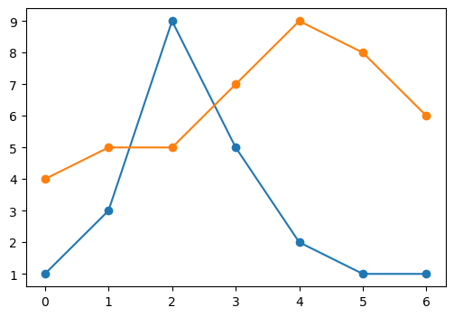
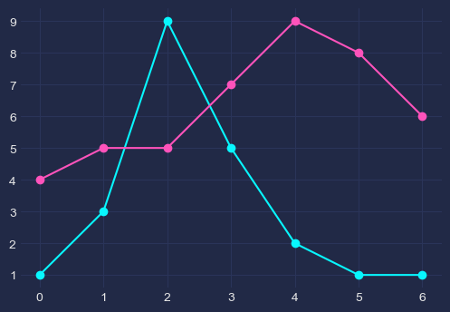
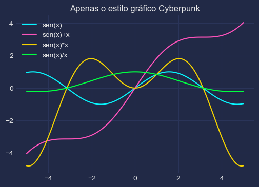
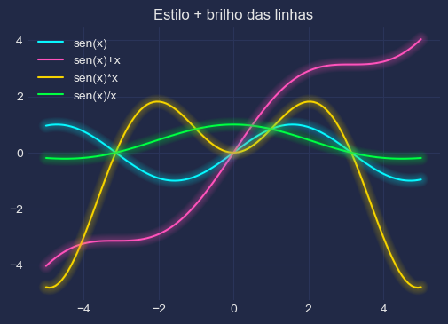
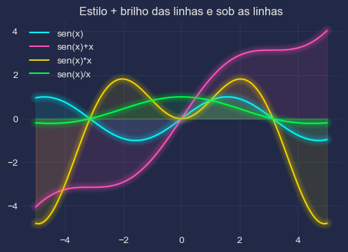

O pacote `cyberpunk` incrementa o estilo visual dos gráficos em Python com apenas 3 linhas adicionais de código. Ele foi construído sobre `matplotlib` por [Dominik Haitz](https://dhaitz.github.io/), e está disponível no [GitHub](https://github.com/dhaitz/mplcyberpunk).

O primeiro passo para sua utilização é a instalação, que pode ser feita no ambiente Jupyter Notebook (como esse post) com um comando mágico, com a seguinte linha de código:


```python
!pip install -q mplcyberpunk
```

A seguir, importamos os pacotes:


```python
import matplotlib.pyplot as plt
import numpy as np
import mplcyberpunk
```


Vamos criar uma função auxiliar para produzir o mesmo gráfico em diferentes configurações:


```python
def graficar():

    plt.plot([1, 3, 9, 5, 2, 1, 1], marker='o')
    plt.plot([4, 5, 5, 7, 9, 8, 6], marker='o')
```

Primeiro apresentamos a figura com as definições padrões `matplotlib`:


```python
graficar()
```





Agora mudamos o estilo para `cyberpunk` e refazemos a mesma figura para comparação:


```python
plt.style.use("cyberpunk")
graficar()
```




O próximo passo é adicionar o efeito de brilho com `add_glow_effects`, veja o código:

```python
graficar()
mplcyberpunk.add_glow_effects()
```


Note que atualmente esse efeito está disponível apenas para linhas. O passo a passo de sua implementação pode ser visto [aqui](https://matplotlib.org/matplotblog/posts/matplotlib-cyberpunk-style/).

Ambos os efeitos de brilho podem ser controlados separadamente com as funções:
* `make_lines_glow` - para o brilho das próprias linhas;
* `add_underglow` - para a área sob as linhas.

Para exemplifica-los, vamos criar outra função gráfica:


```python
def graficar2():

  x = np.linspace(-5, 5, num=120)

  functions = {
      'sen(x)' : np.sin(x),
      'sen(x)+x' : np.sin(x)+x,
      'sen(x)*x' : np.sin(x)*x,
      'sen(x)/x' : np.sin(x)/x
  }

  for key, fun in functions.items():
    plt.plot(x, fun, label=key)

  plt.legend()
```

E seguem os resultados:


```python
graficar2()

plt.title('Apenas o estilo gráfico Cyberpunk');
```





```python
graficar2()

mplcyberpunk.make_lines_glow()

plt.title('Estilo + brilho das linhas');
```





```python
graficar2()

mplcyberpunk.make_lines_glow()
mplcyberpunk.add_underglow()

plt.title('Estilo + brilho das linhas e sob as linhas');
```



