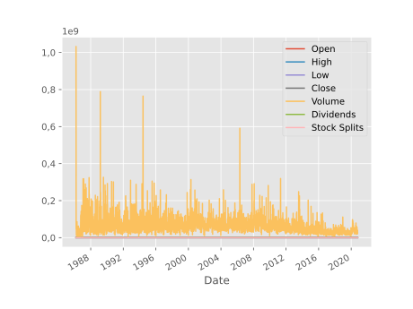
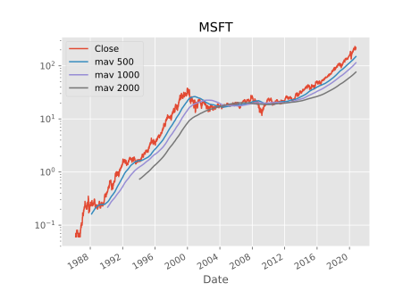
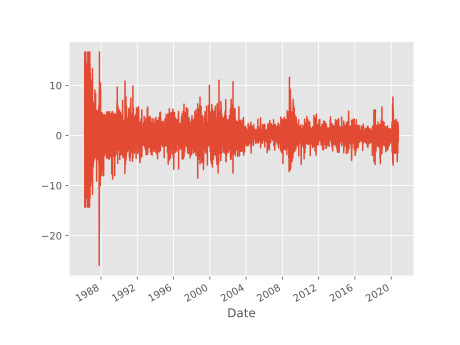
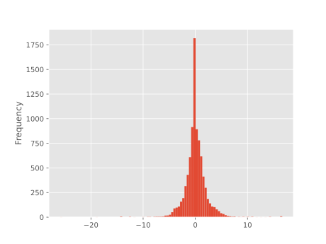
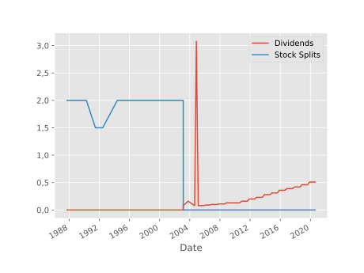
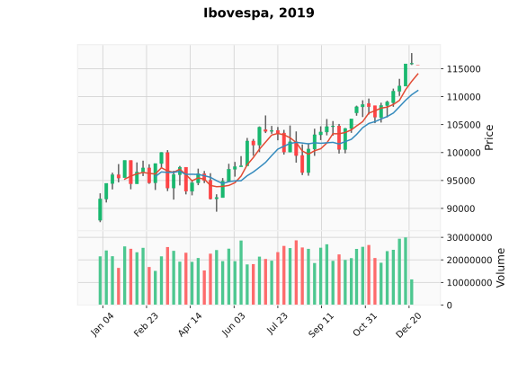

{}

## Introdução

A análise de dados históricos do mercado financeiro pode ser prática para diversos fins, como estudos acadêmicos, gerenciamento de portfólio, criação de conteúdo e outros.

Boa parte dos materiais por aí são baseados naqueles famosos aplicativos de planilha, nada contra, mas eu gosto mesmo de resolver os problemas propostos usando Python. Para isso, vamos usar dois pacotes:

* [yfinance](https://github.com/ranaroussi/yfinance) oferece uma alternativa em Python para baixar dados históricos do mercado financeiro a partir do Yahoo! finanças;

* [mplfinance](https://github.com/matplotlib/mplfinance) é uma utilidade construída sobre Matplotlib, que oferece visualização e análise para dados financeiros.

{}
Lembre-se sempre que lucros passados não são garantia de lucros futuros, e que esse post não é uma recomendação de compra.
{}

O primeiro passo é instalar os pacotes que usaremos, e isso pode ser feito no ambiente Jupyter (como esse post) com o seguinte comando mágico:


```python
!pip install -q yfinance mplfinance
```

E então importamos ambos para a nossa aplicação:


```python
import yfinance as yf
import mplfinance as mpf
```

## Obtenção e manipulação dos dados

O módulo `Ticker` nos permite o acesso a diversos dados de maneira integrada ao Python, e apenas para exemplificar, usaremos a Microsoft, código de negociação `MSFT`:


```python
msft = yf.Ticker("MSFT")
```

Informações completas da companhia são obtidos com o método `info`, como segue:


```python
msft.info
```


```text
    {'zip': '98052-6399',
     'sector': 'Technology',
     'fullTimeEmployees': 163000,
     'longBusinessSummary': 'Microsoft Corporation develops, licenses, and supports software, services, devices, and solutions worldwide. Its Productivity and Business Processes segment offers Office, Exchange, SharePoint, Microsoft Teams, Office 365 Security and Compliance, and Skype for Business, as well as related Client Access Licenses (CAL); Skype, Outlook.com, and OneDrive; LinkedIn that includes Talent, Learning, Sales, and Marketing solutions, as well as premium subscriptions; and Dynamics 365, a set of cloud-based and on-premises business solutions for small and medium businesses, large organizations, and divisions of enterprises. Its Intelligent Cloud segment licenses SQL and Windows Servers, Visual Studio, System Center, and related CALs; GitHub that provides a collaboration platform and code hosting service for developers; and Azure, a cloud platform. It also offers support services and Microsoft consulting services to assist customers in developing, deploying, and managing Microsoft server and desktop solutions; and training and certification to developers and IT professionals on various Microsoft products. Its More Personal Computing segment provides Windows original equipment manufacturer (OEM) licensing and other non-volume licensing of the Windows operating system; Windows Commercial, such as volume licensing of the Windows operating system, Windows cloud services, and other Windows commercial offerings; patent licensing; Windows Internet of Things; and MSN advertising. It also offers Surface, PC accessories, PCs, tablets, gaming and entertainment consoles, and other intelligent devices; Gaming, including Xbox hardware, and Xbox content and services; video games and third-party video game royalties; and Search, including Bing and Microsoft advertising. It sells its products through OEMs, distributors, and resellers; and directly through digital marketplaces, online stores, and retail stores. The company was founded in 1975 and is headquartered in Redmond, Washington.',
     'city': 'Redmond',
     'phone': '425-882-8080',
     'state': 'WA',
     'country': 'United States',
     'companyOfficers': [],
     'website': 'http://www.microsoft.com',
     'maxAge': 1,
     'address1': 'One Microsoft Way',
     'industry': 'Software—Infrastructure',
     'previousClose': 219.66,
     'regularMarketOpen': 220.15,
     'twoHundredDayAverage': 196.80064,
     'trailingAnnualDividendYield': 0.00928708,
     'payoutRatio': 0.3455,
     'volume24Hr': None,
     'regularMarketDayHigh': 222.29,
     'navPrice': None,
     'averageDailyVolume10Day': 27025187,
     'totalAssets': None,
     'regularMarketPreviousClose': 219.66,
     'fiftyDayAverage': 212.05457,
     'trailingAnnualDividendRate': 2.04,
     'open': 220.15,
     'toCurrency': None,
     'averageVolume10days': 27025187,
     'expireDate': None,
     'yield': None,
     'algorithm': None,
     'dividendRate': 2.24,
     'exDividendDate': 1605657600,
     'beta': 0.923331,
     'circulatingSupply': None,
     'startDate': None,
     'regularMarketDayLow': 219.33,
     'priceHint': 2,
     'currency': 'USD',
     'trailingPE': 38.135414,
     'regularMarketVolume': 25074770,
     'lastMarket': None,
     'maxSupply': None,
     'openInterest': None,
     'marketCap': 1662310023168,
     'volumeAllCurrencies': None,
     'strikePrice': None,
     'averageVolume': 33866804,
     'priceToSalesTrailing12Months': 11.623326,
     'dayLow': 219.33,
     'ask': 219,
     'ytdReturn': None,
     'askSize': 1000,
     'volume': 25074770,
     'fiftyTwoWeekHigh': 232.86,
     'forwardPE': 29.967258,
     'fromCurrency': None,
     'fiveYearAvgDividendYield': 1.8,
     'fiftyTwoWeekLow': 132.52,
     'bid': 219,
     'tradeable': False,
     'dividendYield': 0.010199999,
     'bidSize': 1300,
     'dayHigh': 222.29,
     'exchange': 'NMS',
     'shortName': 'Microsoft Corporation',
     'longName': 'Microsoft Corporation',
     'exchangeTimezoneName': 'America/New_York',
     'exchangeTimezoneShortName': 'EDT',
     'isEsgPopulated': False,
     'gmtOffSetMilliseconds': '-14400000',
     'quoteType': 'EQUITY',
     'symbol': 'MSFT',
     'messageBoardId': 'finmb_21835',
     'market': 'us_market',
     'annualHoldingsTurnover': None,
     'enterpriseToRevenue': 11.243,
     'beta3Year': None,
     'profitMargins': 0.30962,
     'enterpriseToEbitda': 24.639,
     '52WeekChange': 0.59857357,
     'morningStarRiskRating': None,
     'forwardEps': 7.33,
     'revenueQuarterlyGrowth': None,
     'sharesOutstanding': 7567649792,
     'fundInceptionDate': None,
     'annualReportExpenseRatio': None,
     'bookValue': 15.626,
     'sharesShort': 39634230,
     'sharesPercentSharesOut': 0.0052,
     'fundFamily': None,
     'lastFiscalYearEnd': 1593475200,
     'heldPercentInstitutions': 0.74093,
     'netIncomeToCommon': 44280999936,
     'trailingEps': 5.76,
     'lastDividendValue': 0.51,
     'SandP52WeekChange': 0.16647923,
     'priceToBook': 14.057341,
     'heldPercentInsiders': 0.014249999,
     'nextFiscalYearEnd': 1656547200,
     'mostRecentQuarter': 1593475200,
     'shortRatio': 1.09,
     'sharesShortPreviousMonthDate': 1598832000,
     'floatShares': 7455727348,
     'enterpriseValue': 1607928643584,
     'threeYearAverageReturn': None,
     'lastSplitDate': 1045526400,
     'lastSplitFactor': '2:1',
     'legalType': None,
     'lastDividendDate': 1597795200,
     'morningStarOverallRating': None,
     'earningsQuarterlyGrowth': -0.151,
     'dateShortInterest': 1601424000,
     'pegRatio': 2.29,
     'lastCapGain': None,
     'shortPercentOfFloat': 0.0053,
     'sharesShortPriorMonth': 36458662,
     'category': None,
     'fiveYearAverageReturn': None,
     'regularMarketPrice': 220.15,
     'logo_url': 'https://logo.clearbit.com/microsoft.com'}
```


Pode-se obter informações sobre os principais acionistas:


```python
msft.major_holders
```


<div>
<style scoped>
    .dataframe tbody tr th:only-of-type {
        vertical-align: middle;
    }

    .dataframe tbody tr th {
        vertical-align: top;
    }

    .dataframe thead th {
        text-align: right;
    }
</style>
<table border="1" class="dataframe">
  <thead>
    <tr style="text-align: right;">
      <th></th>
      <th>0</th>
      <th>1</th>
    </tr>
  </thead>
  <tbody>
    <tr>
      <th>0</th>
      <td>1.42%</td>
      <td>% of Shares Held by All Insider</td>
    </tr>
    <tr>
      <th>1</th>
      <td>74.09%</td>
      <td>% of Shares Held by Institutions</td>
    </tr>
    <tr>
      <th>2</th>
      <td>75.16%</td>
      <td>% of Float Held by Institutions</td>
    </tr>
    <tr>
      <th>3</th>
      <td>4630</td>
      <td>Number of Institutions Holding Shares</td>
    </tr>
  </tbody>
</table>
</div>


```python
msft.institutional_holders
```


<div>
<style scoped>
    .dataframe tbody tr th:only-of-type {
        vertical-align: middle;
    }

    .dataframe tbody tr th {
        vertical-align: top;
    }

    .dataframe thead th {
        text-align: right;
    }
</style>
<table border="1" class="dataframe">
  <thead>
    <tr style="text-align: right;">
      <th></th>
      <th>Holder</th>
      <th>Shares</th>
      <th>Date Reported</th>
      <th>% Out</th>
      <th>Value</th>
    </tr>
  </thead>
  <tbody>
    <tr>
      <th>0</th>
      <td>Vanguard Group, Inc. (The)</td>
      <td>632013255</td>
      <td>2020-06-29</td>
      <td>0.0835</td>
      <td>128621017525</td>
    </tr>
    <tr>
      <th>1</th>
      <td>Blackrock Inc.</td>
      <td>521841633</td>
      <td>2020-06-29</td>
      <td>0.0690</td>
      <td>106199990731</td>
    </tr>
    <tr>
      <th>2</th>
      <td>State Street Corporation</td>
      <td>314554694</td>
      <td>2020-06-29</td>
      <td>0.0416</td>
      <td>64015025775</td>
    </tr>
    <tr>
      <th>3</th>
      <td>FMR, LLC</td>
      <td>236873992</td>
      <td>2020-06-29</td>
      <td>0.0313</td>
      <td>48206226111</td>
    </tr>
    <tr>
      <th>4</th>
      <td>Price (T.Rowe) Associates Inc</td>
      <td>183090016</td>
      <td>2020-06-29</td>
      <td>0.0242</td>
      <td>37260649156</td>
    </tr>
    <tr>
      <th>5</th>
      <td>Capital World Investors</td>
      <td>122923512</td>
      <td>2020-06-29</td>
      <td>0.0162</td>
      <td>25016163927</td>
    </tr>
    <tr>
      <th>6</th>
      <td>Geode Capital Management, LLC</td>
      <td>116688974</td>
      <td>2020-06-29</td>
      <td>0.0154</td>
      <td>23747373098</td>
    </tr>
    <tr>
      <th>7</th>
      <td>Capital International Investors</td>
      <td>98209725</td>
      <td>2020-06-29</td>
      <td>0.0130</td>
      <td>19986661134</td>
    </tr>
    <tr>
      <th>8</th>
      <td>Capital Research Global Investors</td>
      <td>94081197</td>
      <td>2020-06-29</td>
      <td>0.0124</td>
      <td>19146464401</td>
    </tr>
    <tr>
      <th>9</th>
      <td>Northern Trust Corporation</td>
      <td>93331898</td>
      <td>2020-06-29</td>
      <td>0.0123</td>
      <td>18993974561</td>
    </tr>
  </tbody>
</table>
</div>


Os dados históricos são obtidos com o método `history()`, que aceita como argumentos o período desejado, ou datas de início e fim, e retorna um [Pandas `DataFrame`](https://pandas.pydata.org/pandas-docs/stable/reference/api/pandas.DataFrame.html) que contém os preços de abertura e fechamento do mercado, além de máximas e mínimas, o volume de negociação, informações sobre dividendos pagos e desdobramentos.


```python
data = msft.history(period="max")
```

E assim, temos a disposição todos os métodos inerentes do [Pandas](https://pandas.pydata.org/), como `head()`, que nos mostra a parte superior da tabela de dados:


```python
data.head()
```


<div>
<style scoped>
    .dataframe tbody tr th:only-of-type {
        vertical-align: middle;
    }

    .dataframe tbody tr th {
        vertical-align: top;
    }

    .dataframe thead th {
        text-align: right;
    }
</style>
<table border="1" class="dataframe">
  <thead>
    <tr style="text-align: right;">
      <th></th>
      <th>Open</th>
      <th>High</th>
      <th>Low</th>
      <th>Close</th>
      <th>Volume</th>
      <th>Dividends</th>
      <th>Stock Splits</th>
    </tr>
    <tr>
      <th>Date</th>
      <th></th>
      <th></th>
      <th></th>
      <th></th>
      <th></th>
      <th></th>
      <th></th>
    </tr>
  </thead>
  <tbody>
    <tr>
      <th>1986-03-13</th>
      <td>0.06</td>
      <td>0.06</td>
      <td>0.06</td>
      <td>0.06</td>
      <td>1031788800</td>
      <td>0.0</td>
      <td>0.0</td>
    </tr>
    <tr>
      <th>1986-03-14</th>
      <td>0.06</td>
      <td>0.07</td>
      <td>0.06</td>
      <td>0.06</td>
      <td>308160000</td>
      <td>0.0</td>
      <td>0.0</td>
    </tr>
    <tr>
      <th>1986-03-17</th>
      <td>0.06</td>
      <td>0.07</td>
      <td>0.06</td>
      <td>0.07</td>
      <td>133171200</td>
      <td>0.0</td>
      <td>0.0</td>
    </tr>
    <tr>
      <th>1986-03-18</th>
      <td>0.07</td>
      <td>0.07</td>
      <td>0.06</td>
      <td>0.06</td>
      <td>67766400</td>
      <td>0.0</td>
      <td>0.0</td>
    </tr>
    <tr>
      <th>1986-03-19</th>
      <td>0.06</td>
      <td>0.06</td>
      <td>0.06</td>
      <td>0.06</td>
      <td>47894400</td>
      <td>0.0</td>
      <td>0.0</td>
    </tr>
  </tbody>
</table>
</div>


Ou `tail()`, que mostra a parte inferior:


```python
data.tail()
```


<div>
<style scoped>
    .dataframe tbody tr th:only-of-type {
        vertical-align: middle;
    }

    .dataframe tbody tr th {
        vertical-align: top;
    }

    .dataframe thead th {
        text-align: right;
    }
</style>
<table border="1" class="dataframe">
  <thead>
    <tr style="text-align: right;">
      <th></th>
      <th>Open</th>
      <th>High</th>
      <th>Low</th>
      <th>Close</th>
      <th>Volume</th>
      <th>Dividends</th>
      <th>Stock Splits</th>
    </tr>
    <tr>
      <th>Date</th>
      <th></th>
      <th></th>
      <th></th>
      <th></th>
      <th></th>
      <th></th>
      <th></th>
    </tr>
  </thead>
  <tbody>
    <tr>
      <th>2020-10-12</th>
      <td>218.79</td>
      <td>223.86</td>
      <td>216.81</td>
      <td>221.40</td>
      <td>40461400</td>
      <td>0.0</td>
      <td>0.0</td>
    </tr>
    <tr>
      <th>2020-10-13</th>
      <td>222.72</td>
      <td>225.21</td>
      <td>220.43</td>
      <td>222.86</td>
      <td>28950800</td>
      <td>0.0</td>
      <td>0.0</td>
    </tr>
    <tr>
      <th>2020-10-14</th>
      <td>223.00</td>
      <td>224.22</td>
      <td>219.13</td>
      <td>220.86</td>
      <td>23451700</td>
      <td>0.0</td>
      <td>0.0</td>
    </tr>
    <tr>
      <th>2020-10-15</th>
      <td>217.10</td>
      <td>220.36</td>
      <td>216.01</td>
      <td>219.66</td>
      <td>22718400</td>
      <td>0.0</td>
      <td>0.0</td>
    </tr>
    <tr>
      <th>2020-10-16</th>
      <td>220.15</td>
      <td>222.29</td>
      <td>219.33</td>
      <td>219.66</td>
      <td>25074770</td>
      <td>0.0</td>
      <td>0.0</td>
    </tr>
  </tbody>
</table>
</div>


Podemos facilmente produzir um gráfico com o método `plot()`, conforme segue:


```python
data.plot();
```





Essa figura ficou meio poluída visualmente, vamos nos concentrar apenas no preço de fechamento, e acrescentar algumas opções extras:


```python
# Acessamos apenas o preço de fechamento, plotamos com log no eixo y,
# porque é mais representativo, adicionamos um título à figura
data.Close.plot(logy=True, title=msft.info['symbol'])

# Aqui adicionamos médias móveis, porque não?
# mav vem do inglês para moving average
for mav in [500, 1000, 2000]:
  data.Close.rolling(mav).mean().plot(label=f'mav {mav}')

plt.legend();
```





Podemos também calcular e graficar a variação percentual diária do preço como:


```python
data['Var [%]'] = 100. * (data.Close - data.Open) / data.Open

data['Var [%]'].plot();
```





Que pode ser exibida como um histograma de frequências:


```python
data['Var [%]'].plot.hist(bins=100);
```




Temos ainda o método `actions()` que retorna dados históricos sobre dividendos e desdobramento das ações, e perceba que ele pode ser encadeado com o método `plot()`, para múltiplas operações em uma única linha de código:


```python
msft.actions.plot();
```





O método `describe()` é particularmente útil para ter uma rápida representação de uma grande quantidade de dados, fornecendo a contagem, média, desvio padrão, valor mínimo, máximo e outros.


```python
data.describe()
```


<div>
<style scoped>
    .dataframe tbody tr th:only-of-type {
        vertical-align: middle;
    }

    .dataframe tbody tr th {
        vertical-align: top;
    }

    .dataframe thead th {
        text-align: right;
    }
</style>
<table border="1" class="dataframe">
  <thead>
    <tr style="text-align: right;">
      <th></th>
      <th>Open</th>
      <th>High</th>
      <th>Low</th>
      <th>Close</th>
      <th>Volume</th>
      <th>Dividends</th>
      <th>Stock Splits</th>
      <th>Var [%]</th>
    </tr>
  </thead>
  <tbody>
    <tr>
      <th>count</th>
      <td>8722.000000</td>
      <td>8722.000000</td>
      <td>8722.000000</td>
      <td>8722.000000</td>
      <td>8.722000e+03</td>
      <td>8722.000000</td>
      <td>8722.000000</td>
      <td>8722.000000</td>
    </tr>
    <tr>
      <th>mean</th>
      <td>26.930644</td>
      <td>27.217296</td>
      <td>26.637444</td>
      <td>26.937902</td>
      <td>6.000501e+07</td>
      <td>0.002196</td>
      <td>0.001949</td>
      <td>0.067909</td>
    </tr>
    <tr>
      <th>std</th>
      <td>37.001413</td>
      <td>37.388700</td>
      <td>36.589514</td>
      <td>37.016185</td>
      <td>3.867451e+07</td>
      <td>0.040982</td>
      <td>0.061015</td>
      <td>2.052796</td>
    </tr>
    <tr>
      <th>min</th>
      <td>0.060000</td>
      <td>0.060000</td>
      <td>0.060000</td>
      <td>0.060000</td>
      <td>2.304000e+06</td>
      <td>0.000000</td>
      <td>0.000000</td>
      <td>-25.925926</td>
    </tr>
    <tr>
      <th>25%</th>
      <td>2.360000</td>
      <td>2.380000</td>
      <td>2.330000</td>
      <td>2.362500</td>
      <td>3.617535e+07</td>
      <td>0.000000</td>
      <td>0.000000</td>
      <td>-0.781170</td>
    </tr>
    <tr>
      <th>50%</th>
      <td>18.595000</td>
      <td>18.805000</td>
      <td>18.360000</td>
      <td>18.590000</td>
      <td>5.316930e+07</td>
      <td>0.000000</td>
      <td>0.000000</td>
      <td>0.000000</td>
    </tr>
    <tr>
      <th>75%</th>
      <td>26.267500</td>
      <td>26.487500</td>
      <td>25.925000</td>
      <td>26.225000</td>
      <td>7.371192e+07</td>
      <td>0.000000</td>
      <td>0.000000</td>
      <td>0.889940</td>
    </tr>
    <tr>
      <th>max</th>
      <td>229.270000</td>
      <td>232.860000</td>
      <td>227.350000</td>
      <td>231.650000</td>
      <td>1.031789e+09</td>
      <td>3.080000</td>
      <td>2.000000</td>
      <td>16.666667</td>
    </tr>
  </tbody>
</table>
</div>


Esse foi nosso exemplo, informações complementares podem ser encontradas no [post](https://aroussi.com/post/python-yahoo-finance) do autor original do pacote `yfinance`. Experimente executar os exemplos propostos para outros códigos de negociação, por exemplo com o índice [S&P 500](https://pt.wikipedia.org/wiki/S%26P_500) com o ticker `^GSPC`, o índice [Ibovespa](http://www.b3.com.br/pt_br/market-data-e-indices/indices/indices-amplos/ibovespa.htm) com o ticker `^BVSP`, ou empresas brasileiras, como o ticker `ITUB3.SA`, e muitos outros.

## Visualização

A representação gráfica de dados financeiros é mais usual pelo método [Candlestick](https://pt.wikipedia.org/wiki/Candlestick), onde exibe-se os preços de abertura, fechamento, máximo e mínimo de maneira mais compreensiva.

Vamos mudar os dados empregados apenas para ter um segundo exemplo da utilização do `yfinance`, agora especificando uma data de início e fim para a série histórica, e agrupando os resultados no período de uma semana.


```python
data = yf.Ticker('^BVSP').history(start='2019-01-01', end='2019-12-31', interval='1wk')
```

E agora com `mplfinance` e apenas uma linha de código, temos a nossa figura:


```python
mpf.plot(data, type='candle',
         mav=(5,10), volume=True,
         show_nontrading=True, style='yahoo',
         title='Ibovespa, 2019');
```





Bem mais limpa visualmente do que a nossa primeira tentativa, não é mesmo? Perceba que o método aceita diferentes tipos de gráfico, a inclusão de médias móveis (`mav`), o volume de negociações (pode mostrar, ou não), os dias em que não houveram pregão, e pode-se escolher o estilo do gráfico. Informações completas sobre o pacote `mplfinance` estão disponíveis no [link](https://pypi.org/project/mplfinance/).
