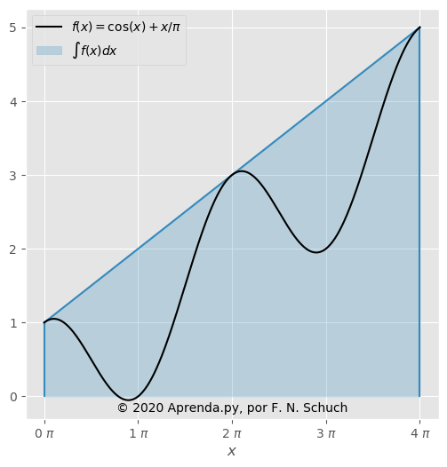
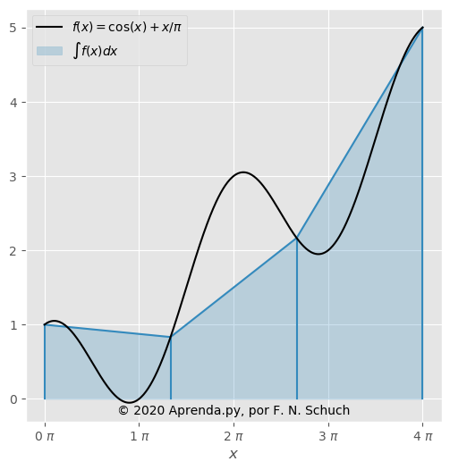
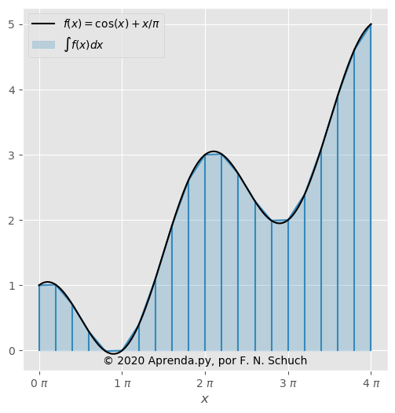
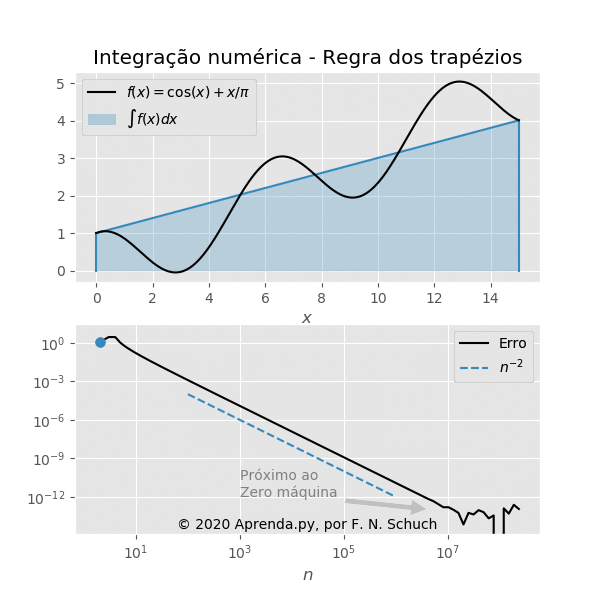

{}

## Introdução

A operação integral é, de maneira geral, representada pela seguinte equação:
\\[
\int_a^b f(x)dx.
\\]

No contexto geométrico, essa operação é capaz de calcular a área sob a curva \\( f(x) \\), para o intervalo \\( a \le x \le b \\). Muitas das funções mais conhecidas apresentam uma integral definida, isso é, podem ser calculadas de forma analítica, e essas definições aparecem em [Tabelas de Integrais](https://www.if.ufrgs.br/tex/fisica-4/tab-integrais.pdf) ou em utilitários de álgebra simbólica ([SymPy](https://www.sympy.org/pt/index.html), por exemplo).

Existem casos onde a solução analítica não é possível, já que a função é de elevada complexidade ou mesmo desconhecida, e aí podemos recorrer aos métodos numéricos.

## Trapézio Simples

A regra do trapézio é uma das primeiras técnicas de integração que aprendemos em um curso de métodos numéricos.
Ela consiste em aproximar a área sob a curva da função \\( f(x) \\) como a área de um trapézio, dada pela equação:

\\[
\int_a^b f(x)dx \approx \dfrac{f(a) + f(b)}{2} (b-a).
\\]

O que seria o equivalente a calcular a área demarcada pela região azul na figura:




Considerando a função \\( f(x) = \cos(x) + x/\pi \\) no intervalo \\( 0 \le x \le 4 \pi \\), podemos facilmente calcular o valor da integral pelo método do trapézio como:

\\[
\int_0^{4 \pi} f(x)dx \approx \dfrac{1 + 5}{2} (4\pi-0) \approx 37,699.
\\]

Sabe-se, entretanto, que a solução exata é aproximadamente \\( 25,133 \\). Nossa estimativa passou longe do valor esperado, mas como podemos melhorar isso?

## Trapézio Composto

Bem, podemos melhorar a aproximação para o cálculo do valor da integral ao aumentarmos o número de trapézios, ou ao usar a regra trapezoidal composta. Ela é dada pela equação:

\\[
\int_a^b fdx \approx \sum_{i=0}^{n-1} \dfrac{f_{i} + f_{i+1}}{2} \Delta x = \dfrac{\Delta x}{2} \left( f_1 + 2f_2 + \dots + 2f_{n-1} + f_{n}\right).
\\]

Vamos considerar a mesma função \\( f(x) = \cos(x) + x/\pi \\) no intervalo \\( 0 \le x \le 4 \pi \\). Se considerarmos \\( n = 4 \\), a integral vai representar a área azul na figura:





Melhor, não? Calcular seu valor já não é tão trivial, mas que tal começarmos a por a mão na massa?


```python
import numpy as np # Importamos nossa biblioteca preferida

def f(x): # Transcrevemos a função dada
    return np.cos(x) + x/np.pi

dx = 4*np.pi/3 # Calculamos o dx para esse caso

# E finalmente calculamos a integral
# pelo método trapezoidal composto
dx*(f(0*dx) + 2*f(1*dx) + 2*f(2*dx) + f(3*dx))/2
```


```text
    25.132741228718345
```


A resposta chegou mais perto. Podemos continuar aumentando o número de pontos empregados para diminuir o erro. Mas mais pontos demandariam muito trabalho com a abordagem que usamos aqui, a equação nem caberia na tela. Vamos automatizar esse processo?

### Implementação

Vamos resolver o método trapezoidal para a mesma função e intervalo, mas agora com ainda mais pontos, que tal \\( n = 21 \\)? A representação visual é essa:





Vamos ir aumentando o nível de requinte do código, para que ele faça todo o trabalho dessa vez:


```python
# Aqui definimos o intervalo que queremos,
# bem como o número de pontos
x = np.linspace(0, 4*np.pi, num=21)

'''
E é tudo que precisamos,
o resto é por conta do computador
'''

y = f(x) # Nossa função já foi definida no bloco anterior

dx = x[1] - x[0] # Obtém o espaçamento

I = 0. # A operação envolve um somatório, então iniciamos uma variável acumuladora

I += dx*y[0]/2

for i in range(1,x.size-1): # Reflita, por que esse laço vai de 1 até n-1?
    I += dx*y[i]

I += dx*y[-1]/2

print(I) # E finalmente temos o resultado
```

```text
    25.132741228718345
```

E estamos cada vez mais perto da resposta exata. Nesse ponto, se estiver seguindo essa lição com uma aplicação Python aberta (**o que é altamente recomendado**), aproveite para experimentar diferentes possibilidades, varie os parâmetros, varie a função, veja o que acontece.

{}
Uma desvantagem dessa abordagem é que o laço `for` vai realizar as operações em série, uma de cada vez, e isso é bem ruim do ponto de vista do desempenho computacional.
{}

{}
Caso não conheça a função `np.linspace`, lembre-se que em Python é sempre possível acessar a documentação facilmente, basta digitar `help(np.linspace)`.
{}

### Operador Integral

Após se divertir com os códigos que criamos até aqui, vamos prosseguir nossa escalada no que se refere a elegância. Vamos apresentar nossa integral na forma de um operador integral. Retorne até a equação da regra trapezoidal composta e dê uma boa olhada. Percebe o padrão? Todos os termos são multiplicados por \\( \Delta x \\), com exceção do primeiro e do último, que são multiplicados por \\( \Delta x / 2 \\). Ora, se isso não tem exatamente a aparência de um vetor preenchido pelo valor 1, onde o primeiro e último elemento são divididos por 2, e então todos multiplicados por \\( \Delta x \\), e por fim somados. São muitas palavras, mas não se assuste, a aparência não é tão ruim:

\\[
\int_a^b f(x) dx = \sum_{i=1}^n \big(
W_i f(x_i) \big),
\\]
sendo o operador integral dado por
\\[
W =
\Delta x [
1/2,  1, \dots, 1, \dots, 1, 1/2 ].
\\]

Tendo em vista que a coordenada `x`, a função `y` e o espaçamento da malha `dx` já foram todos definidos nos blocos anteriores, tudo que precisamos agora é definir o nosso operador integral:


```python
# Iniciamos o operador integral como um vetor
# preenchido por 1, multiplicado por dx
W = dx*np.ones_like(x)

# Dividimos o primeiro e último elemento por 2
for i in [0, -1]:
    W[i] /= 2.0

# A multiplicação do operador pela função e a
# soma dos elementos fornece nossa resposta
np.sum(W * y)
```


```text
    25.132741228718345
```


Nessa opção, após a inicialização, podemos calcular outras integrais apenas repetindo a última linha do código, aumentando a legibilidade e a chance de reutilização do código, e menos linhas para copiar e colar também são um benefício na hora de procurar e corrigir falhas.

{}
Todas as operações embutidas nas principais bibliotecas python (como NumPy e SciPy) empregam conceitos de otimização e programação vetorial, então são preferíveis por aumentar o desempenho computacional.
{}

### Biblioteca SciPy

Meus parabéns se você chegou até aqui, o último passo. Vamos recapitular, já vimos quatro maneiras diferentes para calcular uma integral:

1. Com a regra simples, a resposta veio de uma simples continha;
2. Ao passar para a regra composta as coisas cresceram, usamos uma calculadora;
3. Vimos como automatizar o cálculo, e foi então possível experimentar diversas combinações de parâmetros;
4. Então, aumentamos a elegância e resolvemos o problema de forma matricial.

Agora, a última etapa envolve um dos motivos pelo qual Python tem se tornado tão popular: existe uma infinidade de bibliotecas já programadas, prontas para realizar diversas tarefas. De modo que podemos fazer:


```python
from scipy.integrate import trapz
trapz(y,x)
```


```text
    25.132741228718345
```


Lindo, não? Repare que obtivemos exatamente a mesma resposta para os três últimos exercícios, mostrando que existem diferentes caminhos a serem trilhados. A prática vai lhe permitir escolher entre eles.

Fazemos um destaque à função [scipy.integrate.cumtrapz](https://docs.scipy.org/doc/scipy/reference/generated/scipy.integrate.cumtrapz.html), que calcula a integral de forma acumulativa, que pode ser particularmente útil dependendo da aplicação.

#### Exemplos


```python
# Um exemplo unidirecional
trapz([1,2,3])
```


```text
    4.0
```


```python
# Onde podemos informar como argumento
# opcional o sistema de coordenadas
trapz([1,2,3], x=[4,6,8])
```


```text
    8.0
```


```python
# Ou o espaçamento dos pontos,
# caso seja uniforme
trapz([1,2,3], dx=2)
```


```text
    8.0
```


```python
# Esse é o exemplo de um caso bidimensional
a = np.arange(6).reshape(2, 3)
a
```


```text
    array([[0, 1, 2],
           [3, 4, 5]])
```


```python
# Integral em x
trapz(a, axis=0)
```


```text
    array([1.5, 2.5, 3.5])
```


```python
# Integral em y
trapz(a, axis=1)
```


```text
    array([2., 8.])
```


```python
# Integral dupla: x e então em y
trapz(trapz(a, axis=0), axis=0)
```


```text
    5.0
```


```python
# Integral dupla: y e então em x
trapz(trapz(a, axis=-1), axis=-1)
```


```text
    5.0
```


## Bônus: Erro do método

Por fim, podemos ver que o erro do método numérico decresce exponencialmente, na ordem de \\( n^{-2} \\), em função do aumento do número de pontos:



Mas ele fica saturado por volta de \\( 10^{-12} \\). É hora da reflexão, você sabe me dizer o que acontece ali?
