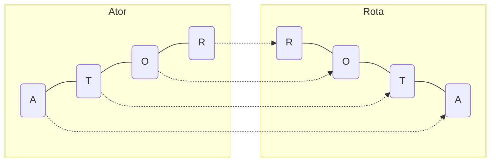

{}

## Introdução

Solucionar problemas é uma questão de prática. É claro que livros, cursos e vídeos são ótimos materiais complementares para melhorar a sua técnica, mas não há como realmente fixar o conhecimento se você não colocar a mão na massa. Mas mesmo compreendendo que devemos praticar, as vezes nos deparamos com outro ponto: Que problema vou resolver para praticar? Temos que prestar atenção, porque os problemas aparecem por todos os lados, e cada problema resolvido nos torna programadores melhores.

Com isso surge esse desafio que eu propus lá no [Intagram @aprenda.py](https://www.instagram.com/aprenda.py/): Você consegue programar uma solução em Python que encontre uma palavra na língua portuguesa que seja um anagrama para _eugenie gut zaza_?

Mas primeiro, vamos à definição do problema: Anagrama é um tipo de jogo de palavras, onde a reorganização das letras de uma palavra ou expressão resulta na obtenção de outras palavras ou expressões. Temos por exemplo _Iracema_ e _América_, ou então _Ator_ e _Rota_:



Agora que sabemos o que são anagramas, vamos ao próximo ponto, como é que encontramos eles para resolvermos a questão proposta?
A prática em resolução de problemas mostra que o ideal é começarmos estabelecendo um passo a passo, dividindo o problema em parcelas menores, a assim termos uma ideia clara sobre como prosseguir até o objetivo, vejamos:

- Devemos procurar uma maneira de _normalizar_ as palavras ou expressões com as quais estamos trabalhando, para facilitar a comparação entre elas. Podemos listar as seguintes operações:
    - Normalizar acentos e caracteres especiais;
    - Remover espaços em branco;
    - Transformar caracteres que porventura esteja em caixa alta, para caixa baixa;
- Então, temos que _inspecionar_ uma palavra ou expressão, e para caracteriza-las, obtendo uma listagem das letras e da sua contagem;
- Com isso, definimos um método para efetivamente _testar_ se duas palavras ou expressões são anagramas entre si;
- Precisamos _obter_ uma lista de palavras válidas na língua portuguesa para testar contra a nossa referência;
- Por fim, precisamos _extrair_ dessa lista todas as palavras que satisfazem o problema.

Já sabemos como proceder, agora, te convido a praticar e tentar resolver o problema.
Mas de qualquer maneira, a seguir temos a solução completa e comentada.

<!--adsense-->

## Metodologia

Como passo inicial, pode ser necessário instalar algumas das bibliotecas Python que vamos utilizar. Duas delas merecem destaque, [beautifulsoup4](https://pypi.org/project/beautifulsoup4/) é uma ferramenta para Web Scraping, com ela vamos obter as palavras válidas de um site de terceiros, e [unidecode](https://pypi.org/project/Unidecode/) será útil para a normalização das variáveis tipo `str` que usaremos nessa solução. Ambos pacotes podem ser instalados com a seguinte linha de comando:

```bash
pip install beautifulsoup4 Unidecode
```

Agora partimos para nossa aplicação Python própriamente dita, começamos com as importações:

```python
import os.path
import time
from collections import Counter

import requests
from bs4 import BeautifulSoup
from unidecode import unidecode
```

### Normalizar

Nós podemos deixar nossa solução mais robusta ao trabalhar com texto, se definirmos uma maneira de normalizar as palavras com as quais vamos lidar. Com [unidecode](https://pypi.org/project/Unidecode/), vamos remover acentos e caracteres especiais, por exemplo, `ç` será transformado em `c`, `ã` será simplesmente `a`, e assim por diante. A operação seguinte é remover os espaços, para isso, temos o método `replace()` das strings, que irá substituir cada espaço `" "` por um caractere vazio `""`. Por fim, o método `lower()` converte todos os caracteres para caixa baixa, garantindo que nossa aplicação não seja sensível quanto à presença de letras maiúsculas e minúsculas. Tudo isso é feito com a seguinte função:

```python
def normalizar_palavra(palavra: str) -> str:
    return unidecode(palavra).replace(" ", "").lower()
```

Vamos testar nossa normalização com a frase:

```python
normalizar_palavra("Canção da América")
```

        'cancaodaamerica'

### Inspecionar

Segundo passo, definimos como _inspecionar_ a tarefa de obter um conjunto com as letras únicas que constituem uma palavra ou expressão, bem como a contagem de aparições de cada letra. Quando falamos em conjuntos de _chave_ (cada caractere que compõem a palavra) e _valor_ (o número de ocorrências), é natural pensar na utilização de um [dicionário](https://docs.python.org/3/tutorial/datastructures.html#dictionaries) Python.
Mas podemos ir um passo além se lembrarmos que Python tem embutido o módulo [collections](https://docs.python.org/3/library/collections.html#module-collections), com estruturas de dados especializadas em certas tarefas, e o dicionário com contagem é uma dessas estruturas, chama-se [Counter](https://docs.python.org/3/library/collections.html#collections.Counter).
Com essa classe especializada, veremos que podemos resolver o problema com menos linhas de código, melhor legibilidade, e menos propensão a erros.
O que definimos como _inspecionar_ será obtido ao enviar uma palavra de entrada _normalizada_ para o estrutura `Counter`, o código é como segue:

```python
def inspecionar_palavra(palavra: str) -> Counter:
    return Counter(normalizar_palavra(palavra))
```

Hora de testar a nossa implementação:

```python
inspecionar_palavra("Aprenda Python")
```


```text
Counter({'a': 2,
        'p': 2,
        'r': 1,
        'e': 1,
        'n': 2,
        'd': 1,
        'y': 1,
        't': 1,
        'h': 1,
        'o': 1})
```

```python
inspecionar_palavra("eugenie gut zaza")
```

```text
Counter({'e': 3, 'u': 2, 'g': 2, 'n': 1, 'i': 1, 't': 1, 'z': 2, 'a': 2})
```

### Testar

Terceiro passo, dadas duas palavras ou expressões, devemos testar se são anagramas (retornando `True`) ou não (retornando `False`). Estabelecemos três critérios para isso:

- Ambas entradas devem ter o mesmo número total de letras únicas, que pode ser testado por meio da função [len()](https://docs.python.org/3/library/functions.html#len);
- Sendo satisfeito o critério anterior, ambas entradas devem ser constituídas pelo mesmo conjunto de letras únicas. Como esses valores estão armazenados como as chaves do nosso dicionário, obtemos eles com o método `keys()`;
- Então, comparamos que a contagem de cada uma das letras é igual entre as duas entradas. Como a contagem é armazenada nos valores dos dicionários, obtemos com o método `values()`.

Se as três condições acima forem satisfeitas, teremos um resultado positivo para anagrama.
Acontece que estamos utilizando a estrutura especializada [Counter](https://docs.python.org/3/library/collections.html#collections.Counter), e aqui vemos as vantagens de estudar e conhecer as peculiaridades dos módulos embutidos em Python.
Realizamos os três testes ao comparar se ambos contadores são iguais, todo o resto já está implementado na classe `Counter`.
Veja como fica o código:


```python
def testa_se_anagrama(inspecionada_1: Counter, inspecionada_2: Counter) -> bool:
    return inspecionada_1 == inspecionada_2
```

Vamos testar com três exemplos:

```python
testa_se_anagrama(
    inspecionar_palavra("Roma"), inspecionar_palavra("amor"),
)
```


    True


```python
testa_se_anagrama(
    inspecionar_palavra("Iracema"), inspecionar_palavra("América"),
)
```


    True


```python
testa_se_anagrama(
    inspecionar_palavra("Python"), inspecionar_palavra("Fortran"),
)
```


    False


Note que a operação `inspecionar_palavra` poderia ter sido executada dentro de `testa_se_anagrama`, mas minha opção foi por não fazê-lo. Como nosso problema proposto envolve testar uma mesma palavra de referência contra uma lista de outras opções, podemos inspecionar a palavra de referências apenas umas vez e aproveitar esse valor nas demais comparações. Veremos mais detalhes sobre isso nos próximos tópicos.

### Obter Lista de Palavras

Quarto passo, temos que obter uma lista de palavras válidas na qual vamos buscar por anagramas. Aqui existe uma série de caminhos para serem seguidos, e algumas decisões a serem tomadas, dependendo das características do problema.
Certamente, podemos começar recorrendo a uma ferramenta de busca sobre como conseguir uma lista de palavras na língua portuguesa dentro de nossa aplicação Python, mas devo dizer que não encontrei nada satisfatório em termos de custo (o tempo que eu levaria para implementar a solução) e benefício (solucionar o problema sem acrescentar demasiada complexidade).


Em um segundo momento, procurei por sites com dicionários online, e foi aí que encontrei [dicio.com.br](https://www.dicio.com.br).
Vi dois pontos fortes no site, eu poderia pesquisar por palavras que começam com uma certa letra, além de poder restringir a busca para o número de letras na palavra.
Veja que para o problema que queremos resolver, estamos procurando por palavras que comecem com `a`, `e`, `g`, `i`, `n`, `t`, `u` e `z`, para um total de `14` letras, e isso reduz drasticamente a nossa busca pela resposta.

Então veio a primeira opção do design da solução, eu pude visitar as 8 páginas do site, uma para cada letra, copiar e colar as listas de palavras e ter rapidamente um protótipo que de fato resolveu o problema. Obtive uma lista com 2010 palavras, e, felizmente, a solução estava entre elas. Em seguida eu pensei, essa é uma chance para mim praticar algo novo, como eu posso automatizar esse processo?

E aqui entre o Web Scraping com o pacote [beautifulsoup4](https://pypi.org/project/beautifulsoup4/), podemos vasculhar o site automaticamente em busca da informação que precisamos. Começamos requisitando a página para nossa aplicação, por exemplo, começando com a letra `z`:

```python
page = requests.get("https://www.dicio.com.br/palavras-comecam-z-com-14-letras/")
```

Em seguida, podemos analisar mais detalhadamente os elementos da página com:

```python
soup = BeautifulSoup(page.content, "html.parser")
```

E é uma verdadeira sopa de letrinhas, você pode imprimir na tela para testar com `print(soup)`, mas o código é muito grande, não ficaria bem no blog, assim preferi não inclui-lo.
Dentro de todo esse código HTML, precisamos encontrar o trecho de informação que nos interessa, e esse é um trabalho bem específico, pois cada site ou página tem sua própria estrutura e tags HTML.
Então, por pura especificidade do site que estamos usando como referência, encontrei o que procuramos com na localidade `soup.find_all("p")[1]`, além de encadear o retorno com `get_text()` como remover todas as tags e aumentar a legibilidade, `strip()` para remover espaçamentos extras e `split()` para quebrar o texto nos espaçamentos, a assim obtemos uma listagem das palavras válidas.
Veja o exemplo:

```python
soup.find_all("p")[1].get_text(separator=" ").strip().split()
```


    ['ziguezagueante',
     'zooterapêutica',
     'zeugobrânquios',
     'zooterapêutico',
     'zoofitantráceo',
     'zigomatolabial',
     'zoocorográfico',
     'zooiatrológico',
     'zoologicamente']


O exemplo com a letra `z` funcionou satisfatoriamente, agora é hora de construírmos uma função que retorne para qualquer letra inicial, além do número de letras desejado na palavra.
Mas antes de irmos ao código, vejamos algumas boas práticas sobre Web Scraping,
lembre-se que estamos consumindo informações do servidor de um terceiro, e não queremos ser rudes e sobrecarregar o serviço.
Então uma das ações do nosso código é sempre salvar para o nosso disco local as listas de palavras para uma dada letra inicial e números de palavras, assim, se solicitarmos a mesma lista, não precisamos de um novo acesso ao site externo, podemos simplesmente carregar nossa cópia local. Um outro cuidado foi implementar um intervalo de 2 segundos entre solicitações, para evitarmos qualquer problema com sobrecarga.
Por fim, vale lembrar que esse método é restrito às características construtivas da URL e do código HTML, e vai parar de funcionar caso algum desses itens seja alterado pelos desenvolvedores do site. Por isso, sempre que possível, verifique se o serviço oferece alguma [API](https://pt.wikipedia.org/wiki/Interface_de_programa%C3%A7%C3%A3o_de_aplica%C3%A7%C3%B5es) para acesso, o que tende a ser mais robusto tanto para quem envia às informações, quanto para quem às consome.

**Nota:** O site que estamos usando para obter palavras válidas ([dicio.com.br](https://www.dicio.com.br)) limita o retorno em mil ocorrências para cada letra inicial, significando que nossa solução não cobrirá necessariamente todas as possibilidades da língua portuguesa, mas ainda assim, acho bastante satisfatório para esse estudo de caso.

Finalmente veja como ficou nossa função:


```python
def obtem_as_palavras_possiveis(primeira_letra: str, numero_de_letras: int) -> list:
    def verifica_se_arquivo_existe(nome_do_arquivo: str) -> bool:
        return os.path.isfile(nome_do_arquivo)

    def leia_o_arquivo(nome_do_arquivo: str) -> str:
        with open(nome_do_arquivo, "r") as file_in:
            texto = file_in.read()
        return texto

    def escreva_o_arquivo(nome_do_arquivo: str, conteudo: str) -> None:
        with open(nome_do_arquivo, "w") as file_out:
            file_out.write(conteudo)

    palavras_alvo = f"palavras-comecam-{primeira_letra}-com-{numero_de_letras}-letras"
    arquivo_backup = palavras_alvo + ".txt"

    # Se o arquivo existe, carregue do disco
    if verifica_se_arquivo_existe(arquivo_backup):
        lista_de_palavras = leia_o_arquivo(arquivo_backup)
    # Senão, obtenha as palavras e salve o arquivo para o disco
    # para que possa ser utilizado da próxima vez
    else:
        page = requests.get(f"https://www.dicio.com.br/{palavras_alvo}/")
        soup = BeautifulSoup(page.content, "html.parser")
        lista_de_palavras = soup.find_all("p")[1].get_text(separator=" ").strip()
        lista_de_palavras = normalizar_palavra(lista_de_palavras)
        escreva_o_arquivo(arquivo_backup, lista_de_palavras)
        time.sleep(2)

    return lista_de_palavras.split()
```

Um teste de funcionalidade:

```python
obtem_as_palavras_possiveis("z", 14)
```


    ['ziguezagueante',
     'zooterapeutica',
     'zeugobranquios',
     'zooterapeutico',
     'zoofitantraceo',
     'zigomatolabial',
     'zoocorografico',
     'zooiatrologico',
     'zoologicamente']


### Extrair Opções Válidas

Chegamos ao último passo que estabelecemos para a resolução do nosso problema, dada uma lista contendo inúmeras palavras, devemos encontrar aquelas que são anagramas de uma certa palavra ou expressão de referência. Isso envolve ainda alguns sub-passos utilizando todas as funções que construímos anteriormente:

- Dada uma `palavra_referencia`, realizamos a _inspessão_ e armazenamos essa informação;
- Precisamos obter as listas de possibilidades válidas, mas lembre-se que podemos limitar o conjunto onde procuramos pela solução se lembrarmos que:
    - Usamos apenas aquelas que comecem com alguma letra que realmente faça parte de `palavra_referencia`;
    - E apenas para aquelas que tenham o mesmo número de caracteres (descontando espaços) que `palavra_referencia`;
- Por fim, dados todos os elementos em `lista_possibilidades`, precisamos filtrar aqueles elementos que sejam anagramas de `palavra_referencia`, a para tanto, usamos a função Python [filter](https://docs.python.org/3/library/functions.html#filter).
Note que `filter` retorna um iterável, então o transformamos para uma lista para a visualização completa da resposta.

Vamos ao código:

```python
def procurar_anagrama(palavra_referencia: str) -> list:
    def compara_contra_alvo(palavra_alvo: str) -> bool:
        return testa_se_anagrama(
            referencia_inspecionada, inspecionar_palavra(palavra_alvo),
        )

    referencia_inspecionada = inspecionar_palavra(palavra_referencia)
    letras_na_referencia = referencia_inspecionada.keys()
    len_referencia = sum(referencia_inspecionada.values())

    lista_possibilidades = []
    for letra in letras_na_referencia:
        lista_possibilidades.extend(obtem_as_palavras_possiveis(letra, len_referencia))

    print(f"Testando anagrama contra {len(lista_possibilidades)} possibilidades")
    return list(filter(compara_contra_alvo, lista_possibilidades))
```

<!--adsense-->

## Resultados

Chegamos ao momento tão aguardado. Após programar uma função para cada passo que estabelecemos para resolver o problema, é hora de conferir a solução. Sem mais delongas, vamos à ela:

```python
procurar_anagrama("eugenie gut zaza")
```


    Testando anagrama contra 2010 possibilidades
    ['ziguezagueante']


Legal, não? `ziguezagueante` é a nossa resposta, você conseguiu achar essa solução na sua própria implementação?

Mas depois de tantas linhas de código, não vamos nos ater somente a isso, vamos ver três testes extras:


```python
procurar_anagrama("Roma")
```


    Testando anagrama contra 632 possibilidades
    ['amor', 'mora', 'moar', 'maro', 'ramo', 'roma']


```python
procurar_anagrama("Aprenda")
```


    Testando anagrama contra 5078 possibilidades
    ['pernada', 'pandear']


```python
procurar_anagrama("Python")
```


    Testando anagrama contra 1005 possibilidades
    []

## Conclusão

Incrível como o que parecia uma proposta despretensiosa pode nos proporcionar em termos de aprendizado quando nos comprometemos à resolver o problema.
E esse conhecimento acumulado vai sem dúvida contribuir para as próximas soluções que precisarmos resolver no futuro.
Mesmo já trabalhando com Python por algum tempo, encontrei nesse exercício a chance de praticar alguns conceitos de design de código de uns livros que tenho lido recentemente, além de usar estruturas especializadas como o `Counter`, bem como foi a primeira vez que usei web scraping em um projeto real.