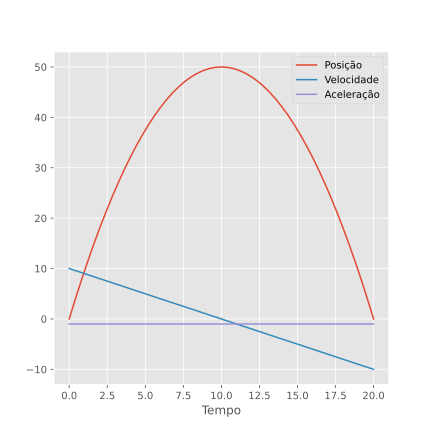
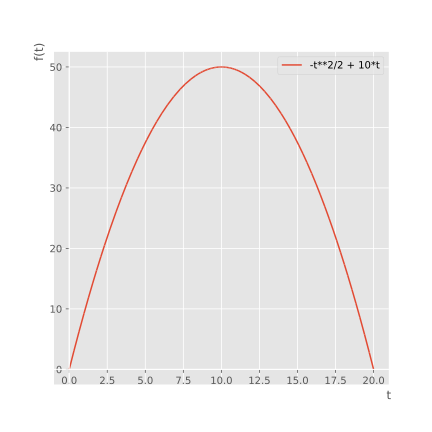

{}

## Introdução

O ambiente Jupyter Notebook vem se consolidando como principal ferramenta de trabalho em Ciência de Dados, Aprendizado de Máquina e Inteligência Artificial.
Muitas das características que o tornam tão popular nessas áreas também o colocam em uma posição de **destaque para o campo educacional**.
As opções mais intuitivas seriam no ensino de engenharia ou ciência exatas em geral, mas não se engane, qualquer atividade que envolva o trabalho com dados pode se beneficiar, incluindo as ciências da saúde e as ciências humanas.

Esse post apresenta uma contextualização sobre o [Projeto Jupyter](https://jupyter.org/), uma explanação sobre a utilidade da ferramenta no cenário pedagógico, além da exemplificação de como se pode avançar progressivamente ao combinar Jupyter com diversas outras ferramentas do universo Python, para tornar a experiência mais agradável tanto para docentes quanto para estudantes. Ao final, apresenta-se a leitura recomendada e exemplos de aplicação.

{}
Essa própria postagem foi produzida a partir de um Jupyter Notebook, assim como muitas outras nesse blog, mostrando a flexibilidade da ferramenta para a produção de conteúdo em geral.
{}

## O que é um Jupyter Notebook?

O [Projeto Jupyter](https://jupyter.org/) foi fundado em 2015, sendo uma organização sem fins lucrativos que visa desenvolver software aberto e serviços para computação interativa. A denominação do projeto é uma referências às três principais linguagens de programação suportadas por ele, [Julia](https://julialang.org/), [Python](https://www.python.org/) e [R](https://www.r-project.org/) ([veja todas as linguagens suportadas aqui](https://github.com/jupyter/jupyter/wiki/Jupyter-kernels)), e também uma homenagem aos cadernos onde [Galileu Galilei](https://pt.wikipedia.org/wiki/Galileu_Galilei) tomava nota de suas descobertas sobre as luas de Júpiter.

O Jupyter Notebook é uma das peças do projeto, compreendendo o software no qual se pode criar os cadernos de anotações Jupyter (*Jupyter notebooks*), que por sua vez são constituídos por um ambiente de programação que **mistura blocos de código executável, visualizações e texto enriquecido** com equações, figuras, animações, tabelas, links que redirecionem para recursos externos, títulos e subtítulos, listas e muitos outros recursos.
Essa flexibilidade permite ao usuário unir código, dados e narrativa, para construir uma verdadeira **história computacional e interativa**.
É possível executar o código, ver o que acontece, modificar e repetir, onde o usuário tem uma *conversa* com os dados que está analisando.
Veja o exemplo a seguir:



Além disso, **Jupyter é uma ferramenta grátis e de código aberto**. Está disponível para os principais sistemas operacionais do mercado e também por serviços remotos na nuvem, onde apenas o acesso a um navegador de internet é o suficiente para utilizar a ferramenta. Esse é um ponto importante frente à outras alternativas de software proprietário, que os alunos muitas vezes sequer conseguem ter acesso fora das instituições de ensino.

### Formas de Acessar/Compartilhar

A maneira mais simples de testar o Jupyter é por meio [Colaboratory](https://colab.research.google.com/), ou simplesmente *Colab*, um serviço Google que permite a criação, colaboração e compartilhamento de Notebooks inteiramente na nuvem.

Outra opção é o [Binder](https://mybinder.org/), serviço na nuvem que permite construir ambientes personalizados e lançar um servidor Jupyter na nuvem a partir de um repositório do GitHub. Além disso, o site apresenta um tutorial de como utilizar o Jupyter em Julia, Python e R.

Para instalação local em sua máquina, o Jupyter já acompanha as principais instalações do [Anaconda](https://www.anaconda.com/), um gerenciador de pacotes Python. Caso já tenha Anaconda instalado mas não o Jupyter, basta utilizar o comando:

``` bash
conda install -c conda-forge jupyterlab
```

Outra possibilidade é o gerenciar de pacotes Python [pip](https://pypi.org/project/pip/), com o comando:

``` bash
pip install jupyterlab
```

Por fim, o [JupyterHub](https://jupyter.org/hub) disponibiliza o poder de Jupyter para um grupo de usuários (estudantes de um curso ou um grupo de pesquisa, por exemplo), gerenciando ambientes virtuais e recursos computacionais.

Os Jupyter notebooks podem ser exportados em diversos formatos, dependendo do meio onde serão distribuídos. O arquivo `.ipynb` é o notebook em sua essência, possibilitando aos demais executar e interagir com o seu conteúdo.
É possível exportar como PDF, para impressão e compartilhamento, Markdown ou HTML para visualização web (como esse post), LaTeX para inclusão em material técnico/científico e até mesmo para apresentação de slides.

## Conceitos Pedagógicos

Como vimos anteriormente, a mistura entre blocos de código executáveis e blocos de texto enriquecido permitem ao Jupyter e seus usuários algo como combinar as explicações tradicionalmente encontrada nos livros com a interatividade de um aplicativo web.
E com isso, Jupyter pode ter seu papel de destaque também como ferramenta educacional.
Por ser tão flexível, se enquadra não apenas em áreas do conhecimento onde a programação é um objetivo final, mas também em áreas onde **a programação se apresenta como um meio para analisar e resolver problemas**.

A aplicação de Jupyter no ensino pode se dar nos mais **diversos formatos**, a depender das necessidades do curso, e do conforto/interesse do instrutor para elaborar o material.
Jupyter pode compreender apenas parte de uma aula, ou um curso inteiro. Pode ser utilizado para produzir a apostila que o turma deverá seguir durante o curso, o material de apoio, leitura complementar, listas de exercícios, exercícios resolvidos ou o gabarito de atividades avaliativas.
Pode ser apresentado e encorajado como um formato no qual os alunos possam realizar e entregar o dever de casa e atividades avaliativas.
Podem ser exibidos durante uma aula demonstrativa, presencial ou online, ou convidar os alunos a interagir com o conteúdo durante uma aula prática em laboratório.
**O objetivo é instigar o aprendizado ativo**, aumentando o engajamento, participação, entendimento, desempenho e a preparação para a carreira futura dos alunos.
É exercitada a criatividade, raciocínio lógico, capacidade de resolver problemas, comunicação e outras habilidades que são indispensáveis para qualquer área de atuação.

## Curva de Progressão

Esta seção apresenta uma descrição (não exaustiva) da curva de aprendizado para alunos e instrutores, exemplificada com programação em Python e suas principais bibliotecas de uso geral.

Mas antes de começar, vale mencionar que o nível zero é dominar as denominadas células *Markdown*, para texto enriquecido. Nelas, é possível inserir equações com sintaxe $\LaTeX$:

$$E = mc^2,$$

títulos e subtítulos, texto em **destaque** e *itálico*. Temos também listas:

- Item 1
- Item 2
- Item 3

Citações:

> Considere usar Jupyter na sua instituição de ensino (2021, F. N. Schuch).

Além de código com destaque de sintaxe, lista de tarefas, tabelas, figuras, vídeos, links e muito mais ([veja mais detalhes aqui](https://guides.github.com/features/mastering-markdown/)).

### Nível Inicial

Uma vez que sabemos como adicionar blocos explicativos detalhados, o próximo passo é trabalhar com blocos de código. Vamos tomar como exemplo o caso do movimento uniformemente variável, onde a posição de um dado objeto no espaço em função do tempo é dado pela seguinte equação:

$$ S(t) = S_0 + v_0t + \dfrac{at^2}{2}, $$

onde $S$ é a posição, $S_0$ a posição inicial, $v_0$ é a velocidade inicial, $a$ a aceleração e $t$ o tempo.

Digamos que a aula não seja de programação, mas mesmo assim, a turma pode ser convidada a interagir com o problema e testar diferentes respostas ao alterar os parâmetros quando o seguinte bloco de código é fornecido:

``` Python
# Atribuímos os parâmetros do problema
S0 = 0
v0 = 10
a = -1
t = 10

# A equação que descreve o problema
S = S0 + v0 * t + (a * t ** 2) / 2

# Por fim, exibimos a resposta
print(S)
```

``` text
50.0
```

Essa situação pode se aplicar nas mais diversas disciplinas que envolvam algum tipo de cálculo, análise de dados e/ou tomada de decisão.
Ou dependendo do objetivo do material, o bloco de código pode estar em vazio, servindo como um convite para que a turma resolva o problema por meio de ferramentas computacionais com uma barreira de entrada mínima.

### Nível Intermediário

Como próximo passo, pode-se incluir mais aspectos de lógica de programação, como: [laços](https://docs.python.org/pt-br/3/tutorial/controlflow.html#for-statements), [testes lógicos](https://docs.python.org/pt-br/3/tutorial/controlflow.html#if-statements), [entrada e saída de arquivos](https://docs.python.org/pt-br/3/tutorial/inputoutput.html), [funções](https://docs.python.org/pt-br/3/tutorial/controlflow.html#defining-functions), [controle de erros e exceções](https://docs.python.org/pt-br/3/tutorial/errors.html) e a manipulação de [estruturas de dados]((https://docs.python.org/pt-br/3/tutorial/datastructures.html)).

Outro ponto chave é a utilização de ferramentas mais sofisticadas para álgebra matricial, produção de gráficos, álgebra analítica e métodos numéricos. Quatro exemplos são incluídos a seguir.

#### Numpy

[Numpy](https://numpy.org/) é um pacote fundamental para a computação científica em Python. Dentre outras coisas, destaca-se pela definição e **manipulação de arranjos de dados multidimensionais** (tensores), conveniente álgebra linear, transformada de Fourier e capacidade de produzir números aleatórios.

No nível anterior, o problema do movimento uniformemente variável foi resolvido para obter a distância de deslocamento para um único ponto no tempo. Vamos usar um espaço linear do Numpy, indo de 0 à 20, discretizado em 51 pontos temporais. O código é o que segue:

``` Python
# Importamos a biblioteca
import numpy

# Criamos o espaço linear
tempo = numpy.linspace(0, 20, num=51, endpoint=True)

# Exibimos a variável na tela
tempo
```

``` text
array([ 0. ,  0.4,  0.8,  1.2,  1.6,  2. ,  2.4,  2.8,  3.2,  3.6,  4. ,
        4.4,  4.8,  5.2,  5.6,  6. ,  6.4,  6.8,  7.2,  7.6,  8. ,  8.4,
        8.8,  9.2,  9.6, 10. , 10.4, 10.8, 11.2, 11.6, 12. , 12.4, 12.8,
       13.2, 13.6, 14. , 14.4, 14.8, 15.2, 15.6, 16. , 16.4, 16.8, 17.2,
       17.6, 18. , 18.4, 18.8, 19.2, 19.6, 20. ])
```

Calculamos novamente o deslocamento, agora para o vetor do bloco anterior, para cada ponto no espaço temporal teremos o retorno da respectiva posição, usando o seguinte código:

``` Python
# Calcula o vetor posição
posicao = S0 + v0 * tempo + (a * tempo ** 2) / 2

# Exibe o resultado na tela
posicao
```

``` text
array([ 0.  ,  3.92,  7.68, 11.28, 14.72, 18.  , 21.12, 24.08, 26.88,
       29.52, 32.  , 34.32, 36.48, 38.48, 40.32, 42.  , 43.52, 44.88,
       46.08, 47.12, 48.  , 48.72, 49.28, 49.68, 49.92, 50.  , 49.92,
       49.68, 49.28, 48.72, 48.  , 47.12, 46.08, 44.88, 43.52, 42.  ,
       40.32, 38.48, 36.48, 34.32, 32.  , 29.52, 26.88, 24.08, 21.12,
       18.  , 14.72, 11.28,  7.68,  3.92,  0.  ])
```

Podemos extrair mais informações do vetor posição que obtivemos no bloco anterior, se lembrarmos que a velocidade para cada instante é igual ao diferencial da posição com relação ao tempo.
Mostrar exatamente como se programa um esquema diferencial é uma boa opção para um curso de métodos numéricos, ou a turma pode ser convidada a programar por si mesma.
De qualquer modo, pode-se verificar o resultado também utilizando as funções de cálculo numérico que acompanham a biblioteca Numpy, como por exemplo [numpy.gradient](https://numpy.org/doc/stable/reference/generated/numpy.gradient.html). Note que, em Python, pode-se acessar a documentação da função ao digitar `help(numpy.gradient)`, ou ainda com o comando mágico `numpy.gradient?` quando em um ambiente Jupyter. O comando `numpy.gradient??` retorna o código fonte da função, possibilitando assim investigar como ela realmente foi programada.
O primeiro argumento informado para a função é o arranjo sobre o qual será calculado o gradiente, seguido pelo arranjo de coordenadas, o tempo nesse caso. `edge_order` é um argumento opcional que permite escolher a precisão da derivada junto aos contornos, por padrão esse valor é 1, mas podemos usar segunda ordem ao escolher o valor 2. Veja como fica o código:

``` python
# Diferencial da posição com relação ao tempo
velocidade = numpy.gradient(posicao, tempo, edge_order=2)

# Exibe o resultado na tela
velocidade
```

``` text
array([ 1.00000000e+01,  9.60000000e+00,  9.20000000e+00,  8.80000000e+00,
        8.40000000e+00,  8.00000000e+00,  7.60000000e+00,  7.20000000e+00,
        6.80000000e+00,  6.40000000e+00,  6.00000000e+00,  5.60000000e+00,
        5.20000000e+00,  4.80000000e+00,  4.40000000e+00,  4.00000000e+00,
        3.60000000e+00,  3.20000000e+00,  2.80000000e+00,  2.40000000e+00,
        2.00000000e+00,  1.60000000e+00,  1.20000000e+00,  8.00000000e-01,
        4.00000000e-01,  7.10542736e-15, -4.00000000e-01, -8.00000000e-01,
       -1.20000000e+00, -1.60000000e+00, -2.00000000e+00, -2.40000000e+00,
       -2.80000000e+00, -3.20000000e+00, -3.60000000e+00, -4.00000000e+00,
       -4.40000000e+00, -4.80000000e+00, -5.20000000e+00, -5.60000000e+00,
       -6.00000000e+00, -6.40000000e+00, -6.80000000e+00, -7.20000000e+00,
       -7.60000000e+00, -8.00000000e+00, -8.40000000e+00, -8.80000000e+00,
       -9.20000000e+00, -9.60000000e+00, -1.00000000e+01])
```

A aceleração, por sua vez, é igual ao diferencial da velocidade com relação ao tempo. Seguindo a mesma lógica do bloco anterior, temos:

``` Python
# Diferencial da velocidade com relação ao tempo
aceleracao = numpy.gradient(velocidade, tempo, edge_order=2)

# Exibe o resultado na tela
aceleracao
```

``` text
array([-1., -1., -1., -1., -1., -1., -1., -1., -1., -1., -1., -1., -1.,
       -1., -1., -1., -1., -1., -1., -1., -1., -1., -1., -1., -1., -1.,
       -1., -1., -1., -1., -1., -1., -1., -1., -1., -1., -1., -1., -1.,
       -1., -1., -1., -1., -1., -1., -1., -1., -1., -1., -1., -1.])
```

Note que a aceleração constante está em conformidade com o problema aqui exemplificado, do movimento uniformemente variável.

Confira a [Documentação Numpy](https://numpy.org/doc/) para ver tudo que o pacote tem a oferecer.

#### Matplotlib

[Matplotlib](https://matplotlib.org/) é uma biblioteca de **plotagem em Python**, que produz figuras com qualidade de publicação em uma variedade de formatos e ambientes interativos. Você pode gerar gráficos, histogramas, espectros de potência, gráficos de barras, gráficos de erro, diagramas de dispersão e muito mais, com apenas algumas linhas de código, confira a [Galeria de Exemplos](https://matplotlib.org/3.1.0/gallery/index.html).

Seguindo o caso de estudo dessa postagem, a visualização dos resultados do movimento uniformemente variável é realizada com o seguinte bloco de código:

``` Python
# Importamos o pacote
from matplotlib import pyplot

# Descrevemos as três linhas que irão compor o gráfico
pyplot.plot(tempo, posicao, label = 'Posição')
pyplot.plot(tempo, velocidade, label = 'Velocidade')
pyplot.plot(tempo, aceleracao, label = 'Aceleração')

# Ativamos a legenda
pyplot.legend()

# Definimos a notação do eixo horizontal
pyplot.xlabel('Tempo')
```



E assim, além da análise numérica, temos ferramentas de **visualização integradas ao ambiente Jupyter**. Os alunos são convidados a interagir com a aplicação, podendo facilmente alterar os parâmetros do problema e investigar as mudanças provocadas nos resultados.

#### Sympy

[Sympy](https://www.sympy.org) é uma biblioteca Python para **matemática simbólica**. Seu objetivo é tornar-se um sistema de álgebra computacional (CAS) completo, mantendo o código o mais simples possível, para ser compreendido e facilmente extensível.

Exemplificamos o uso de matemática simbólica aqui em nosso estudo de caso. Para tanto, importamos Sympy, atribuímos para variáveis Python as suas representações simbólicas com [sympy.symbols](https://docs.sympy.org/latest/modules/core.html#module-sympy.core.symbol), construímos a equação analítica para o movimento uniformemente variável, e por fim apresentamos a equação resultante na tela:

``` Python
import sympy  # Importamos o pacote

# Declaramos os símbolos
S0, v0, a, t = sympy.symbols("S_0 v_0 a t")

# Atribuímos a equação proposta
eq_posicao = S0 + v0 * t + (a * t ** 2) / 2

# Exibimos a equação na tela
eq_posicao
```

$$ S_0 + v_0t + \dfrac{at^2}{2} $$

Um recurso interessante é a substituição alguns dos símbolos por um valor numérico:

``` Python
eq_posicao.subs({S0: 0, v0: 10, a: -1})
```

$$ - \frac{t^{2}}{2} + 10 t$$

Com isso, podemos graficar (com Matplotlib) a solução analítica:

``` Python
sympy.plotting.plot(
    eq_posicao.subs({S0: 0, a: -1, v0: 10}), (t, 0, 20), legend=True
)
```



Ou ainda substituir todos os valores, e obter o dado deslocamento para o tempo 10, por exemplo:

``` Python
eq_posicao.subs({S0: 0, v0: 10, a: -1, t: 10})
```

``` text
50.0
```

A solução analítica para a velocidade é obtida ao diferenciar a equação da posição em relação ao tempo:

``` Python
# Velocidade é o diferencial da posição pelo tempo
eq_velocidade = sympy.diff(eq_posicao, t)

# Exibimos a equação na tela
eq_velocidade
```

$$ a t + v_{0} $$

De maneira semelhante, a solução analítica para a aceleração é obtida ao diferenciar a equação da velocidade em relação ao tempo:


``` Python
# Aceleração é o diferencial da velocidade pelo tempo
eq_aceleracao = sympy.diff(eq_velocidade, t)

# Exibimos a equação na tela
eq_aceleracao
```

$$ a $$

A aceleração é uma constante, afinal, esse é o movimento uniformemente variável.

Muitos outros recursos estão disponíveis para a álgebra analítica com Sympy, como derivadas, integrais, limites, expansões em séries, aproximação para esquemas de diferenças finitas, resolução de equações (inclusive equações diferenciais), álgebra matricial, inequações, estatística, probabilidade, e muitos outros. Para uma visão completa, consulte a [Documentação Sympy](https://docs.sympy.org/).

#### Scipy

Por último, mas não menos importante, [Scipy](https://www.scipy.org/).
Mais do que uma biblioteca Python, Scipy é uma coleção de software de **código aberto para computação científica em Python**. Fazem parte do projeto Numpy, Matplotlib e Sympy, que foram demonstradas anteriormente, [IPython](https://ipython.org/), que é na verdade o precursor do Projeto Jupyter, além de Pandas, que veremos a seguir.
Por estarem todas essas importantes bibliotecas no contexto de um mesmo projeto, percebemos a grande sinergia e interoperabilidade entre elas.

Além disso, a própria biblioteca Scipy, um componente do universo Scipy, fornece muitas rotinas numéricas para: Integração numérica, diferenciação numérica, otimização, interpolação, transformada de Fourier, processamento de sinal, álgebra linear e álgebra linear esparsa, solução de problemas de autovalor, estatística, processamento de imagens e I/O de arquivos. Confira todos os detalhes na [Documentação Scipy](https://docs.scipy.org/doc/).

### Nível Avançado

Após construir a base da solução de problemas por ferramentas numéricas e analíticas na seção anterior, além de vermos como realizar gráficos com Matplotlib, chegamos agora à etapa final.

Nesse ponto, vale destacar a importância de balancear o nível de complexidade da resolução dos problemas com a expectativa didática, a experiência dos alunos pode ser frustrante ao se deparar com centenas de linha de código sem sentido. Esse ponto de equilíbrio deve ser avaliado caso a caso.

A seguir, veremos alternativas para estruturas de dados, e também opções para produção de figuras interativas, que são uma grande ajuda para análise e interpretação dos resultados. Vale destacar que embora esses elementos apresentem uma barreira de entrada ligeiramente maior, uma vez sejam dominados, acabam por simplificar o fluxo de trabalho, permitindo **resolver problemas mais complicados utilizando menos linhas de código**.

#### Estruturas de Dados

Um passo natural após dominar Numpy, é partir para estruturas de dados mais elaboradas.
O [Pandas](https://pandas.pydata.org/) é um pacote Python que fornece **estruturas de dados rápidas, flexíveis e expressivas**, projetadas para tornar o trabalho com dados *relacionais* ou *rotulados* fáceis e intuitivos.
A ferramenta apresenta dois tipos primários de estruturas de dados: [Series](https://pandas.pydata.org/docs/reference/api/pandas.Series.html#pandas.Series) (unidimensional) e [DataFrame](https://pandas.pydata.org/docs/reference/api/pandas.DataFrame.html#pandas.DataFrame) (bidimensional); sendo ideal para trabalhar com dados tabelados (SQL, arquivos Excel ou CSV, por exemplo), que cobre a vasta maioria da análise de dados em casos como finanças, estatística, ciências sociais e diversas áreas da engenharia.
Uma das vantagens de utilizar Pandas é a facilidade com que podemos converter dados entre diferentes ferramentas. Na verdade, Pandas foi justamente construída sobre Numpy, e projetada para se integrar perfeitamente com todo a ambiente de computação científica.

Seguindo o nosso estudo de caso, podemos agrupar os quatro vetores que construímos em Numpy em uma única estrutura Pandas, segundo o código:

``` Python
# Importamos o pacote
import pandas

# Criamos um DataFrame com base nos vetores
# que produzimos anteriormente com Numpy
tabela = pandas.DataFrame(
    {
        "Tempo": tempo,
        "Posição": posicao,
        "Velocidade": velocidade,
        "Aceleração": aceleracao,
    },
)

# Exibimos as 5 primeiras linhas da tabela na tela com .head()
tabela.head()
```

|    |   Tempo |   Posição |   Velocidade |   Aceleração |
|---:|--------:|----------:|-------------:|-------------:|
|  0 |     0   |      0    |         10   |           -1 |
|  1 |     0.4 |      3.92 |          9.6 |           -1 |
|  2 |     0.8 |      7.68 |          9.2 |           -1 |
|  3 |     1.2 |     11.28 |          8.8 |           -1 |
|  4 |     1.6 |     14.72 |          8.4 |           -1 |

Obtemos facilmente uma descrição dos dados, incluindo a contagem, média, desvio padrão, e outros, basta utilizar o método `.describe()`, como segue:

``` Python
tabela.describe()
```

|       |    Tempo |   Posição |    Velocidade |   Aceleração |
|:------|---------:|----------:|--------------:|-------------:|
| count | 51       |   51      |  51           | 51           |
| mean  | 10       |   32.6667 |   1.2539e-15  | -1           |
| std   |  5.94643 |   15.6486 |   5.94643     |  8.35323e-14 |
| min   |  0       |    0      | -10           | -1           |
| 25%   |  5       |   21.12   |  -5           | -1           |
| 50%   | 10       |   36.48   |   7.10543e-15 | -1           |
| 75%   | 15       |   46.6    |   5           | -1           |
| max   | 20       |   50      |  10           | -1           |

Conseguimos graficar todos os dados contidos na tabela com o método do DataFrame Pandas `.plot()`, que internamente está invocando Matplotlib, mas para o usuário, basta digitar:

``` Python
tabela.plot(x='Tempo')
```


Note que é exatamente a mesma figura que obtivemos antes com Matplotlib, mas dessa vez necessitamos de apenas uma linha de código. Recomenda-se a leitura da [Documentação Pandas](https://pandas.pydata.org/docs/getting_started/overview.html) para uma visão geral de todas as vantagens que o pacote oferece.

Pandas funciona muito bem para dados 1D e 2D, mas **e se o problema tiver mais dimensões**? Bom, felizmente para esse caso temos [Xarray](http://xarray.pydata.org/en/stable/), um pacote Python para lidar com arranjos catalogados N-dimensionais, também construído sobre Numpy, e com as funcionalidades fortemente inspiradas em Pandas. Xarray é ainda capaz de lidar com computação paralela e mesmo arquivos maiores do que a memória disponível, graças a sua integração com [Dask](https://dask.org/). Temos um tutorial completo disponível em:



#### Figuras Interativas

Para exposição interativa dos resultados, possibilitando um *conversa* com os dados, outros pacotes gráficos Python surgem como alternativa à Matplotlib. Um exemplo é [Plotly](https://plotly.com/), que também está disponível para R e JavaScript. Os nossos dados tabelados são apresentados de maneira interativa com o seguinte bloco de código (experimente interagir com o mouse e testar as diferentes ferramentas):

``` Python
import plotly.express as px

fig = px.line(
    tabela,
    x="Tempo",
    y=["Posição", "Velocidade", "Aceleração"],
    title="Uma Figura Interativa",
)
fig.show()
```



Novamente, no contexto educacional, **a turma é convidada a interagir com os resultados**, modificar parâmetros, analisar os novos resultados, em um aprendizado ativo.

Existe uma série de outras ferramentas gráficas interativas disponíveis para as mais diversas aplicações, podemos citar:
[altair](https://altair-viz.github.io/),
[bokeh](https://bokeh.org/),
[holoviews](https://holoviews.org/),
e [seaborn](https://seaborn.pydata.org/).

#### Outros

Temos algumas outras ferramentas que merecem destaque no ambiente Jupyter com aplicações didáticas:

- [ipywidgets](https://github.com/jupyter-widgets/ipywidgets) fornece uma série de widgets interativos, como botões, caixas de seleção, controles deslizantes e muito mais, permitindo criar ferramentas interativas avançadas para análise e resolução de problemas, uma opção perfeita para aplicativos de ensino;
- [voilà](https://github.com/voila-dashboards/voila) permite exportar todos os elementos de um Jupyter Notebook para uma apresentação em estilo aplicativo web. Confira a [Galeria Voilà](https://voila-gallery.org/) para visualizar diversos exemplos;
- [nbgrader](https://nbgrader.readthedocs.io/en/stable/) é uma ferramenta voltada para auxiliar os instrutores na atribuição e avaliação de tarefas em Jupyter Notebooks.

## Leitura Recomendada

- **Teaching and Learning with Jupyter**, *Lorena A. Barba, Lecia J. Barker, Douglas S. Blank, Jed Brown, Allen B. Downey, Timothy George, Lindsey J. Heagy, Kyle T. Mandli, Jason K. Moore, David Lippert, Kyle E. Niemeyer, Ryan R. Watkins, Richard H. West, Elizabeth Wickes, Carol Willing, and Michael Zingale*. Open Book 2019. [Disponível online](https://jupyter4edu.github.io/jupyter-edu-book/).

## Exemplos

- 
- 
- 
- 

## Conclusão

Esse foi um material demonstrativo sobre o emprego do Jupyter Notebook no contexto didático, uma vez que a ferramenta permite misturar trechos de texto descritivo com blocos de código interativos (assim como essa própria postagem), visando aumentar a participação, engajamento e desempenho dos estudantes das mais diversas áreas do conhecimento.
Jupyter é um software gratuito e de código aberto, disponível em todos os sistemas operacionais e em servidores na nuvem (teste sem nenhuma instalação), além de ser compatível com dezenas de diferentes linguagens de programação.
Por ser tão flexível, se enquadra não apenas em áreas do conhecimento onde a programação é um objetivo final, mas também em áreas onde a programação se apresenta como um meio para analisar e resolver problemas.
Para uma demonstração mais imersivas, diversos pacotes Python de aplicação geral foram exemplificados.
Certamente existe uma infinidade de outros pacotes Python com relevância ao contexto educacional, principalmente quando pensamos em soluções para problemas de domínios mais específicos.
Mas de qualquer maneira, espero que essa leitura auxilie na disseminação dessa incrível ferramenta de ensino.
