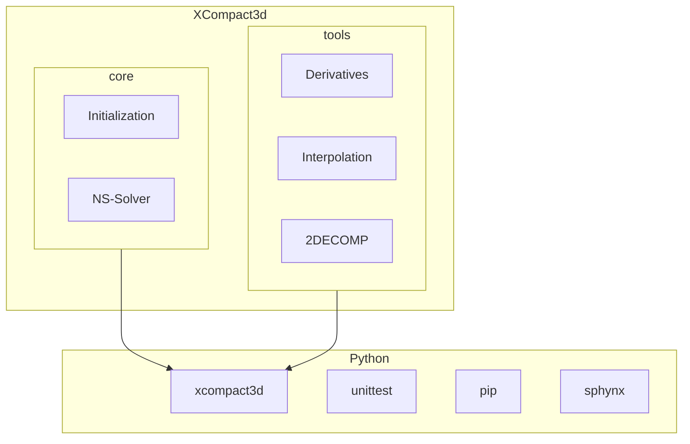

```mermaid
flowchart TD
    subgraph x3d[XCompact3d]
        subgraph tools
            Derivatives
            Interpolation
            2DECOMP
        end
        subgraph core
            Initialization
            NS-Solver
        end
    end
    core --> xcompact3d
    tools --> xcompact3d
    subgraph Python
        xcompact3d
        unittest
        pip
        sphynx
    end
```

```json
{
  "theme": "base",
  "themeVariables": {
    "fontFamily": "arial",
    "fontSize": "20px"
  }
}
```