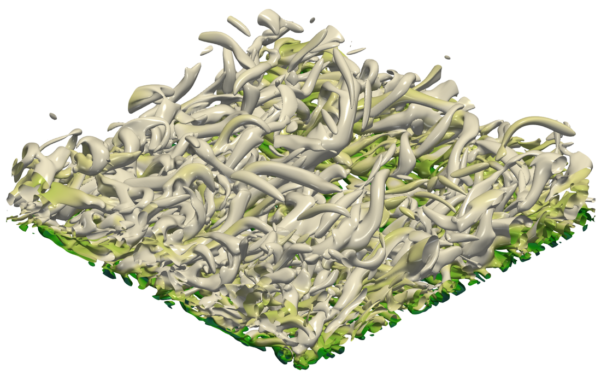
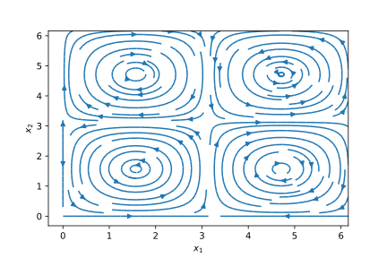
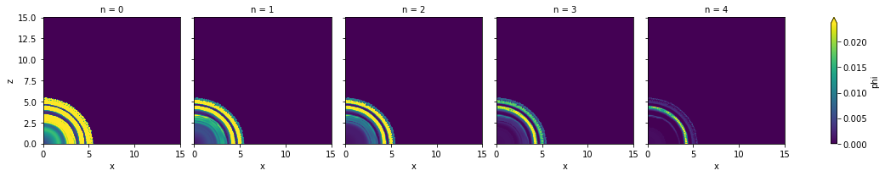
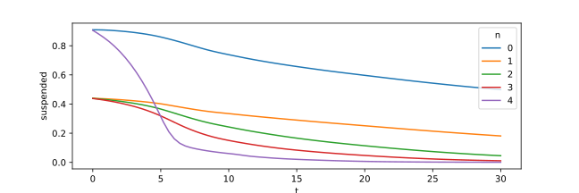

## Python and XCompact3d




#### XCompact3d 2021 Online Developer Meeting

**Felipe N. Schuch**_, LaSET, School of Technology, PUCRS._



- Hi, my name is Felipe;
- Today I gonna talk about Python and XCompact3d;
- Starting with a quick introduction;
- Then I gonna show a little bit of what I've been doing in this TOPIC;
- And finally, I will bring some points for discussion here with you, especially AIMING to improve the synergy between Python and XCompact.


---

# Introduction

---

### Why Python?

- **Computational cost** vs **Cost for development**;
- Faster to Prototype ideas;
- Code interactively using [IPython](https://ipython.org) and [Jupyter](https://jupyter.org);
- It is a great tool for pre and post-processing.


- I don't know if everyone here already uses Python, so I gonna start with **Why Python**;
- Many people MAY SAY it is a terrible tool because it DOESN'T **RUN** SO fast as other alternatives;
- But to THOSE people I say, we need to look at the big picture, lets also talk about the COST for development, HUMAN RESOURCES;
- Here is where Python is really good;
- Together with the INTERACTIVE tools like Jupyter, Python is a very popular CHOICE for data science;
- And in our case, it's a great tool for pre and post-processing.


---

### Why Numpy?

- It is a Python library that provides a **multidimensional array object** and an assortment of routines for fast operations on arrays;
- Much faster option, because it runs in optimized, pre-compiled C code;
- With Numpy, we have the best of two worlds, the **performance** of compiled code in the background, together with the **flexibility** of Python code for the user.

<small>See https://numpy.org</small>


- And now, Why Numpy?
- It provides **multidimensional ARRAY** operations in Python;
- It is much faster than pure Python, because it runs in OPTIMIZED, pre-compiled C code;
- With Numpy, we have the best of two WORLDS, the **performance** of compiled code, together with the **flexibility** of Python CODE FOR THE USER.


---

#### Numpy - Example

```python
x = np.linspace(start=0., stop=2*np.pi, num=50)
y = np.linspace(start=0., stop=2*np.pi, num=50)

ux = np.sin(x[:,np.newaxis])*np.cos(y[np.newaxis,:])
uy = -np.cos(x[:,np.newaxis])*np.sin(y[np.newaxis,:])

int = np.trapz(np.trapz(ux, x=x, axis=0), x=y, axis=0)

plt.streamplot(x,y,ux.T,uy.T)
plt.xlabel(r"$x_1$"); plt.ylabel(r"$x_2$");
```




- This is a little workflow using Numpy;
  - We start here setting two vectors, they will work as our coordinates, **x** and **y**;
  - Now you see that booth **ux** and **uy** are 2D, but Numpy doesn't know it, so we should inform it using this `np.newaxis` notation;
  - And we can compute a integration in this plane, but it is up to the user to keep track of the coordinates and the number of each AXIS.
  - The plot is just for reference;
- But WHO am I to complain about Numpy?
  - It is the core of the scientific ecosystem in Python;
  - I Just wanna show you that we can use Numpy in a better way;


---

### Why Xarray?

- Xarray introduces labels in the form of dimensions, coordinates and attributes on top of raw NumPy-like multidimensional arrays, which allows for a more intuitive, more concise, and less error-prone developer experience;
- Besides, it is integrated to other tools for:
  - Plotting ([matplotlib](http://matplotlib.org/), [HoloViews](http://holoviews.org/) and others);
  - Parallel computing ([Dask](http://dask.org/));
  - I/O ([NetCDF](http://www.unidata.ucar.edu/software/netcdf)).

<small>See http://xarray.pydata.org</small>


- WITH Xarray.
- It introduces labels in the form of dimensions, coordinates and attributes on top of raw NumPy arrays, which allows for a more intuitive, more CONCISE, and LESS ERROR-PRONE **DEVELOPER** experience:
  - Xarray can do axis alignment and broadcast AUTOMATICALLY for any array operation;
- Besides, it's integrated with other tools for Plotting, Parallel computing and I/O.


---

#### Xarray - Example

```python
dataset = xr.Dataset(
    coords={
        "y": np.linspace(start=0.0, stop=2 * np.pi, num=50),
        "x": np.linspace(start=0.0, stop=2 * np.pi, num=50),
    }
)
dataset["ux"] = np.sin(dataset["x"]) * np.cos(dataset["y"])
dataset["uy"] = -np.cos(dataset["x"]) * np.sin(dataset["y"])
dataset
```

```text
<xarray.Dataset>
Dimensions:  (x: 50, y: 50)
Coordinates:
  * y        (y) float64 0.0 0.1282 0.2565 0.3847 ... 5.899 6.027 6.155 6.283
  * x        (x) float64 0.0 0.1282 0.2565 0.3847 ... 5.899 6.027 6.155 6.283
Data variables:
    ux       (x, y) float64 0.0 0.0 0.0 0.0 ... -2.369e-16 -2.429e-16 -2.449e-16
    uy       (x, y) float64 -0.0 -0.1279 -0.2537 ... 0.2537 0.1279 2.449e-16
```

<small>**Note:** This is just the string representation, the dataset will look even better in HTML when running in Jupyter.</small>


- See this example using xarray;
- We start with the dataset OBJECT, informing the coordinates in this DICT-LIKE constructor;
- Now we can access the coordinates by THEIR name, and with it, xarray knows this result should be 2D;
- We can investigate the dataset, its dimensions, coordinates and variables, ALL TOGETHER in a single object;
- We will see more examples applied to xcompact soon;


---

## `XCompact3d-toolbox`

https://xcompact3d-toolbox.readthedocs.io

- The physical and computational parameters are built on top of [traitlets](https://traitlets.readthedocs.io/en/stable/index.html):
    - [IPywidgets](https://ipywidgets.readthedocs.io/en/latest/) for a friendly user interface;
- Data structure is provided by [xarray](http://xarray.pydata.org/en/stable/), again with:
  - Plotting ([matplotlib](http://matplotlib.org/), [HoloViews](http://holoviews.org/) and others);
  - Parallel computing ([Dask](http://dask.org/));
  - I/O ([NetCDF](http://www.unidata.ucar.edu/software/netcdf)).


- But first, lets talk about the **toolbox**;
- It is a Package designed to handle pre and post-processing in Python;
- Actually, it is more like a Python WRAPPER, because it RELIES HEAVILY on other Python tools;
- For instance, the physical and computational parameters are built on top of TRAITLETS;
  - Together with a friendly user interface in IPywidgets;
- And the Data structure is provided by Xarray, again with support for Plotting, Parallel computing and I/O;


---

#### Parameters' consistency with [Traitlets](https://traitlets.readthedocs.io/en/stable/index.html)

```python
>>> prm = x3d.Parameters(loadfile="example.i3d")
>>> # Type checking
>>> prm.iibm = 10.0
TraitError: The 'iibm' trait of a Parameters instance expected an int,
not the float 10.0.
>>> # Limits are imposed
>>> prm.iibm = 5 # <--- This can be only 0, 1 or 2, as x3d expects
TraitError: The value of the 'iibm' trait of a Parameters instance
should not be greater than 2, but a value of 5 was specified
```

```python
>>> # On change validation
>>> prm.nx = 93
TraitError: Invalid value for mesh points (nx)
>>> prm.nx = 17
>>> # On chance callbacks
>>> print(prm.nclx1, prm.nclxn, prm.nx, prm.dx)
2 2 17 0.0625
>>> prm.nclx1 = 0 # <--- Setting periodic BC
>>> print(prm.nclx1, prm.nclxn, prm.nx, prm.dx)
0 0 16 0.0625
```


- With Traitlets, the parameters can be checked for consistence;
- The GOAL here is to anticipate some user mistakes;
- For instance:
  - The parameters are type checked;
  - We can impose some boundaries;
  - We can see some on CHANGE validations;
  - And onchange callbacks;
- So, with it, we make sure that the parameters file will be compatible with xcompact3d;


---

#### User Interface with IPywidgets ([try it online](https://xcompact3d-toolbox.readthedocs.io/en/v0.1.11/tutorial/parameters.html))

<div class="animations">
  
</div> 

<!-- <small>[Try it online](https://xcompact3d-toolbox.readthedocs.io/en/latest/tutorial/parameters.html#).</small> -->


- And all the behaviors we saw in the command line are also available at the user interface;
- As you can see, we ensure that booth boundaries in one direction will be periodic or not at the same time, and the number of **MESH** POINTS goes BACK and FORWARD properly;
- You can see the estimation for size in disk changing as well;
-It is  pretty cool, you can try it online in this link.


---

#### `XCompact3d-toolbox` - Example

```python
prm = x3d.Parameters(loadfile="input.i3d")
ds = xr.Dataset()
# Make sure to have enough memory!
for var in "ux uy uz pp".split():
    ds[var] = prm.read_all_fields(f"./data/3d_snapshots/{var}-*.bin")
ds["phi"] = xr.concat([prm.read_all_fields(f"./data/3d_snapshots/phi{n+1}-*.bin") for n in range(prm.numscalar)], "n",).assign_coords(n=("n", range(prm.numscalar)))
ds
```

```text
<xarray.Dataset>
Dimensions:  (n: 5, t: 76, x: 721, y: 49, z: 721)
Coordinates:
  * x        (x) float32 0.0 0.02083 0.04167 0.0625 ... 14.94 14.96 14.98 15.0
  * z        (z) float32 0.0 0.02083 0.04167 0.0625 ... 14.94 14.96 14.98 15.0
  * y        (y) float32 0.0 0.02083 0.04167 0.0625 ... 0.9375 0.9583 0.9792 1.0
  * n        (n) int32 0 1 2 3 4
  * t        (t) float64 0.0 0.4 0.8 1.2 1.6 2.0 ... 28.4 28.8 29.2 29.6 30.0
Data variables:
    phi      (n, t, x, y, z) float32 dask.array<chunksize=(5, 1, 721, 49, 721), meta=np.ndarray>
    ux       (t, x, y, z) float32 dask.array<chunksize=(1, 721, 49, 721), meta=np.ndarray>
    uy       (t, x, y, z) float32 dask.array<chunksize=(1, 721, 49, 721), meta=np.ndarray>
    uz       (t, x, y, z) float32 dask.array<chunksize=(1, 721, 49, 721), meta=np.ndarray>
    pp       (t, x, y, z) float32 dask.array<chunksize=(1, 721, 49, 721), meta=np.ndarray>
```


- Now we have a real case using a xarray dataset;
- This is from a polidispersed Turbidity Current in Axisymmetric Configuration;
- We start with an empty dataset, and them populate it with all the variables from our simulation;
- You see here the three velocity components and pressure;
- With toolbox, we can read all files at once;
- Besides five scalar fractions are concatenated in just one array with this command here;
- And finally, we can see the dataset, with:
  - 5 scalar fractions, from 76 snapshots in time, with this spatial resolution;
  - The coordinates are also INCLUDED. With xarray, we can do many operations calling the coordinates by name, it is very powerful;
  - and we see the five variables.
- For me, it is really impressive to have ALL data AVAILABLE FOR US at once here in this single object;
- **But JUST MAKE SURE to have have enough memory for it!**
- Now, lets see how to use it


---

#### Xarray - Working with coordinates

```python
ds.phi.sel(t=10.0).mean("y").plot(col="n")
```



```python
ds['suspended'] = ds.phi.integrate(["x", "y", "z"]); ds.suspended.plot(hue="n")
```



```python
ds['w1'] = ds.uz.differentiate("y") - ds.uy.x3d.first_derivative("z")
```


- In the first example:
  - From the dataset, we select the scalar;
  - I'm choosing JUST where time is equals to 10.0;
  - Computing a vertical average calling the coordinate by its name;
  - And finally a plot for reference, presenting each scalar fraction in a different figure;
  - The settling velocity is different for each fraction, so that is why the concentration is decreasing from LEFT to RIGHT;
- In the second line, I'm showing how to compute the suspended material, it is defined as the volumetric INTEGRATION of the concentration fields, we can code it in this way, and again a plot for reference;
- And the last code shows how to compute the first component of VORTICITY;
  - It is equal to `duz / dy` **SUBTRACTING** `duy / dz`;
  - We can use the standard second order scheme from xarray;
  - Or the high order alternative from the toolbox;
- From my experience working with xarray, we can solve more complicated PROBLEMS with **FEWER** lines of code;
- Besides, calling the coordinates by their name, makes our code VERY READABLE, AND CONSEQUENTLY, it is easier to collaborate, share and maintain;


---

### Could we handle larger-than-memory Datasets?

- Yes, if the files were written as [NetCDF](https://www.unidata.ucar.edu/software/netcdf/):

  ```
  ds = xr.open_mfdataset("./data/3d_snapshots/*.nc")
  ```

- Actually, it is just what we did! In the previous example we handled a `66,5GB` dataset in a `8GB` virtual machine;

- Let's consider implementing I/O with [NetCDF](https://www.unidata.ucar.edu/software/netcdf/) at XCompact3d?

<small>**Note:** I've written a script to convert raw binaries to NetCDF, in order to test this concept.</small>


- But, how about this question?
- Can we handle larger-than-memory Datasets?
- Yes, we can, and we just did it;
- The example WE JUST SAW WAS A `60 GB` dataset, working on a `8 GB` virtual machine in our campus, that I accessed remotely;
- I wrote a script to convert the RAW BINARIES to NetCDF, aiming to test this CONCEPT;
- And now you tell me, would you like to work in this way?
  - Opening the entire dataset with just one command line?
  - It uses lazy computation, so the data will only be transfered to the memory when demanded;
- Which leads to another question: Let’s consider implementing I/O with NetCDF at XCompact3d?


---

## Integrating Python and XCompact3d


- Now talking more specifically about the integrating between Python and XCompact3d


---

#### [F2PY](https://numpy.org/devdocs/f2py/index.html) - Fortran to Python interface generator

```fortran
! xcompact3d.f90 | mpirun -n 4 ./xcompact3d
program xcompact3d

  use core

  implicit none

  call init_xcompact3d()
  call main_loop()
  call finalise_xcompact3d()

end program xcompact3d
```

```python
# xcompact3d.py | mpirun -n 4 python xcompact3d.py
from xcompact3d import core

if __name__ == '__main__':
    core.init_xcompact3d()
    core.main_loop()
    core.finalise_xcompact3d()
```

<small>**Note:** This example actually works, and with no performance penalty.</small>


- F2PY is a tool from the Scipy / Numpy universe, it is a FORTRAN TO PYTHON **INTERFACE GENERATOR**;
- And this is a working prototype;
- I just rearranged a little the FORTRAN code, putting everything in this module called core, so we can still run it;
- F2PY produces the Python interface;
- And now we can access the same module core here in Python, and we can, actually, run the simulation WITH NO PERFORMANCE PENALTY;
- Because we are running with the exactly same compiled code;
- AND, AFTER TESTING IT, A HAD SOME IDEAS.


---

### Overview / Objectives



- Make key subroutines available in Python;
- Testing them individually with [unittest](https://docs.python.org/3/library/unittest.html) will increase XCompact3d's maintainability;
- Distributing the compiled code with [pip](https://pypi.org/project/pip/) may increase our user base.


- Using F2PY, we could make some key subroutines available in Python:
  - For the simulation itself, but also post-processing;
- We could test them with UNITARY TEST, increasing the codes **MAINTAINABILITY**;
- We could distribute the compiled code, in order to increase our user base;
- And all of this with no significant change at the fortran code;
- So, of course, it would be still possible to download the code from source, compile it, and keep our WORKFLOW just as it is today, but OPENING **SOME** new possibilities.


---

#### [F2PY](https://numpy.org/devdocs/f2py/index.html) - Fortran to Python interface generator
#### The next steep

```python
from xcompact3d import core, solver

if __name__ == "__main__":

    core.init_xcompact3d()

    while solver.is_running:

        my_own_boundary_conditions() # Low cost, very customizable
        solver.advance_time() # High performance with Fortran code
        my_own_postprocessing() # Low cost, very customizable

    core.finalise_xcompact3d()
```

<small>**Note 1:** Here we have every Python tool at our disposal, like modules for optimization, control, visualization, machine learning, I/O, GPU accelerated computing ([CuPy](https://cupy.dev/)), etc.</small>
<small>**Note 2:** It results in a very customizable interface without affecting the main code in Fortran.</small>


- This is how I plan the next step;
- We could make more routines available, for instance, open up the main loop;
  - There is here at the begging, lets say, my own boundary conditions coded in Python, very customizable;
  - From the solver, we call `advance_time` with the performance and scalability that we are USED to;
  - After that, we could call on board postprocessing, again, very customizable in Python.
- The main point here is that we have EVERY Python tool at our DISPOSAL, like modules for optimization, control, visualization, machine learning, I/O, maybe some GPU accelerated computing and many others.
- It results in a very flexible interface without affecting the main code in Fortran.


---

### It is time to discuss the conclusions


> <small>**Felipe N. Schuch**, LaSET, School of Technology, PUCRS.<br></small>
> <small>:house: [fschuch.com](www.fschuch.com/en) :envelope: felipe.schuch@edu.pucrs.br</small>


<!-- <small>www.fschuch.com/en/slides/2021-x3d-showcase</small> -->


- **THAT IS IT**, I have no conclusion, because I think we could discuss IT NOW;
- So, Please, let me know what do you think about it.
