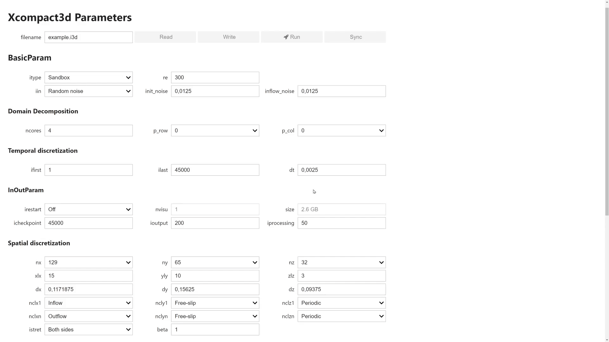

## Python and XCompact3d


#### XCompact3d 2021 Online Developer Meeting

**Felipe N. Schuch**_, LaSET, School of Technology, PUCRS._



- Hi, my name is Felipe;


---

# Introduction

---

### Why Python?

- **Cost for development** vs **Computational cost**;
- Faster to Prototype ideas;
- Code interactively using [IPython](https://ipython.org) and [Jupyter](https://jupyter.org);
- It is a great tool for pre and post-processing.

---

### Why Numpy?

- It is a Python library that provides a **multidimensional array object** and an assortment of routines for fast operations on arrays;
- Much faster option, because it runs in in optimized, pre-compiled C code;
- With Numpy, we have the best of two worlds, the **performance** of compiled code in the background, together with the **flexibility** of Python code for the user.

<small>See https://numpy.org</small>

---

### Numpy - Example

```python
x = np.linspace(start=0., stop=2*np.pi, num=50)
y = np.linspace(start=0., stop=2*np.pi, num=50)

ux = np.sin(x[:,np.newaxis])*np.cos(y[np.newaxis,:])
uy = -np.cos(x[:,np.newaxis])*np.sin(y[np.newaxis,:])

plt.streamplot(x,y,ux.T,uy.T)
plt.xlabel(r"$x_1$"); plt.ylabel(r"$x_2$");
```


---

### Why Xarray?

- Xarray introduces labels in the form of dimensions, coordinates and attributes on top of raw NumPy-like multidimensional arrays, which allows for a more intuitive, more concise, and less error-prone developer experience;
- Besides, it is integrated to other tools for:
  - Plotting ([matplotlib](http://matplotlib.org/), [HoloViews](http://holoviews.org/) and others);
  - Parallel computing ([Dask](http://dask.org/));
  - I/O ([NetCDF](http://www.unidata.ucar.edu/software/netcdf)).

<small>See http://xarray.pydata.org</small>

---

### Xarray - Example

```python
dataset = xr.Dataset(
    coords={
        "y": np.linspace(start=0.0, stop=2 * np.pi, num=50),
        "x": np.linspace(start=0.0, stop=2 * np.pi, num=50),
    }
)
dataset["ux"] = np.sin(dataset["x"]) * np.cos(dataset["y"])
dataset["uy"] = -np.cos(dataset["x"]) * np.sin(dataset["y"])
dataset
```

```text
<xarray.Dataset>
Dimensions:  (x: 50, y: 50)
Coordinates:
  * y        (y) float64 0.0 0.1282 0.2565 0.3847 ... 5.899 6.027 6.155 6.283
  * x        (x) float64 0.0 0.1282 0.2565 0.3847 ... 5.899 6.027 6.155 6.283
Data variables:
    ux       (x, y) float64 0.0 0.0 0.0 0.0 ... -2.369e-16 -2.429e-16 -2.449e-16
    uy       (x, y) float64 -0.0 -0.1279 -0.2537 ... 0.2537 0.1279 2.449e-16
```

<small>**Note:** This is just the string representation, the dataset will look even better in HTML when running in Jupyter.</small>

---

## `XCompact3d-toolbox`

https://xcompact3d-toolbox.readthedocs.io

- The physical and computational parameters are built on top of [traitlets](https://traitlets.readthedocs.io/en/stable/index.html):
    - [IPywidgets](https://ipywidgets.readthedocs.io/en/latest/) for a friendly user interface;
- Data structure is provided by [xarray](http://xarray.pydata.org/en/stable/), again with:
  - Plotting ([matplotlib](http://matplotlib.org/), [HoloViews](http://holoviews.org/) and others);
  - Parallel computing ([Dask](http://dask.org/));
  - I/O ([NetCDF](http://www.unidata.ucar.edu/software/netcdf)).

---

#### Parameters' consistency with [Traitlets](https://traitlets.readthedocs.io/en/stable/index.html)

```python
>>> prm = x3d.Parameters(loadfile="example.i3d")
>>> # Type checking
>>> prm.iibm = 10.0
TraitError: The 'iibm' trait of a Parameters instance expected an int,
not the float 10.0.
>>> # Limits are imposed
>>> prm.iibm = 5
TraitError: The value of the 'iibm' trait of a Parameters instance
should not be greater than 2, but a value of 5 was specified
```

```python
>>> # On change validation
>>> prm.nx = 93
TraitError: Invalid value for mesh points (nx)
>>> prm.nx = 17
>>> # On chance callbacks
>>> print(prm.nclx1, prm.nclxn, prm.nx, prm.dx)
2 2 17 0.0625
>>> prm.nclx1 = 0 # <--- Setting periodic BC
>>> print(prm.nclx1, prm.nclxn, prm.nx, prm.dx)
0 0 16 0.0625
```

---

#### User Interface with IPywidgets ([try it online](https://xcompact3d-toolbox.readthedocs.io/en/v0.1.11/tutorial/parameters.html))

<div class="animations">
  
</div> 

<!-- <small>[Try it online](https://xcompact3d-toolbox.readthedocs.io/en/latest/tutorial/parameters.html#).</small> -->


- I've talked about improving the learning curve for beginners in our code, and here is another initiative.
- We have this user interface with IPywidgets under development in our LAB;
- Using it, we can enforce the right relationship between the parameters, just to make sure they are compatible with xcompact3d;
- You can see here that we ensure that booth boundaries in one direction will be periodic or not, and the number of mesh points goes BACK and FORWARD properly.
There are more features, but I will leave the link here, so you can try it.


---

#### `XCompact3d-toolbox` - Example

```python
prm = x3d.Parameters(loadfile="input.i3d")
ds = xr.Dataset()
# Make sure to have enough memory!
for var in "ux uy uz pp".split():
    ds[var] = prm.read_all_fields(f"./data/3d_snapshots/{var}-*.bin")
ds["phi"] = xr.concat([prm.read_all_fields(f"./data/3d_snapshots/phi{n+1}-*.bin") for n in range(prm.numscalar)], "n",).assign_coords(n=("n", range(prm.numscalar)))
ds
```

```text
<xarray.Dataset>
Dimensions:  (n: 5, t: 76, x: 721, y: 49, z: 721)
Coordinates:
  * x        (x) float32 0.0 0.02083 0.04167 0.0625 ... 14.94 14.96 14.98 15.0
  * z        (z) float32 0.0 0.02083 0.04167 0.0625 ... 14.94 14.96 14.98 15.0
  * y        (y) float32 0.0 0.02083 0.04167 0.0625 ... 0.9375 0.9583 0.9792 1.0
  * n        (n) int32 0 1 2 3 4
  * t        (t) float64 0.0 0.4 0.8 1.2 1.6 2.0 ... 28.4 28.8 29.2 29.6 30.0
Data variables:
    phi      (n, t, x, y, z) float32 dask.array<chunksize=(5, 1, 721, 49, 721), meta=np.ndarray>
    ux       (t, x, y, z) float32 dask.array<chunksize=(1, 721, 49, 721), meta=np.ndarray>
    uy       (t, x, y, z) float32 dask.array<chunksize=(1, 721, 49, 721), meta=np.ndarray>
    uz       (t, x, y, z) float32 dask.array<chunksize=(1, 721, 49, 721), meta=np.ndarray>
    pp       (t, x, y, z) float32 dask.array<chunksize=(1, 721, 49, 721), meta=np.ndarray>
```

---

#### Xarray - Working with coordinates

```python
ds.phi.sel(t=10.0).mean("y").plot(col="n")
```


```python
ds['suspended'] = ds.phi.integrate(["x", "y", "z"]); ds.suspended.plot(hue="n")
```


```python
ds['w1'] = ds.uz.differentiate("y") - ds.uy.x3d.first_derivative("z")
```

---

### Could we handle larger-than-memory Datasets?

- Yes, if the files were written as [NetCDF](https://www.unidata.ucar.edu/software/netcdf/):

  ```
  ds = xr.open_mfdataset("./data/3d_snapshots/*.nc")
  ```

- Actually, it is just what we did! In the previous example we handled a `66,5GB` dataset in a `8GB` virtual machine;

- Let's consider implementing I/O with [NetCDF](https://www.unidata.ucar.edu/software/netcdf/) at XCompact3d?

<small>**Note:** I wrote a script to convert raw binaries to NetCDF, in order to test this concept.</small>

---

## Integrating Python and XCompact3d

---

#### [F2PY](https://numpy.org/devdocs/f2py/index.html) - Fortran to Python interface generator

```fortran
! xcompact3d.f90 | mpirun -n 4 ./xcompact3d
program xcompact3d

  use core

  implicit none

  call init_xcompact3d()
  call main_loop()
  call finalise_xcompact3d()

end program xcompact3d
```

```python
# xcompact3d.py | mpirun -n 4 python xcompact3d.py
from xcompact3d import core

if __name__ == '__main__':
    core.init_xcompact3d()
    core.main_loop()
    core.finalise_xcompact3d()
```

<small>**Note:** This example actually works, and with no performance penalty.</small>

---

### Overview / Objectives


- Make key subroutines available in Python;
- Testing them individually with [unittest](https://docs.python.org/3/library/unittest.html) will increase XCompact3d's maintainability;
- Distributing the compiled code with [pip](https://pypi.org/project/pip/) may increase our user base.

---

#### [F2PY](https://numpy.org/devdocs/f2py/index.html) - Fortran to Python interface generator
#### The next steep

```python
from xcompact3d import core, solver

if __name__ == "__main__":

    core.init_xcompact3d()

    while solver.is_running:

        my_own_boundary_conditions() # Low cost, very customizable
        solver.advance_time() # High performance with Fortran code
        my_own_postprocessing() # Low cost, very customizable

    core.finalise_xcompact3d()
```

<small>**Note 1:** Here we have every Python tool at our disposal, like optimization, control, visualization, machine learning, I/O, and many others.</small>
<small>**Note 2:** It results in a very customizable interface without affecting the main code in Fortran.</small>

---

### It is time to discuss the conclusions


> <small>**Felipe N. Schuch**, LaSET, School of Technology, PUCRS.<br></small>
> <small>:house: [fschuch.com](www.fschuch.com/en) :envelope: felipe.schuch@edu.pucrs.br</small>


<!-- <small>www.fschuch.com/en/slides/2021-x3d-showcase</small> -->


- **THAT IS IT**, tank you very much for your ATTENTION;
- I'm ready to take any questions now.
