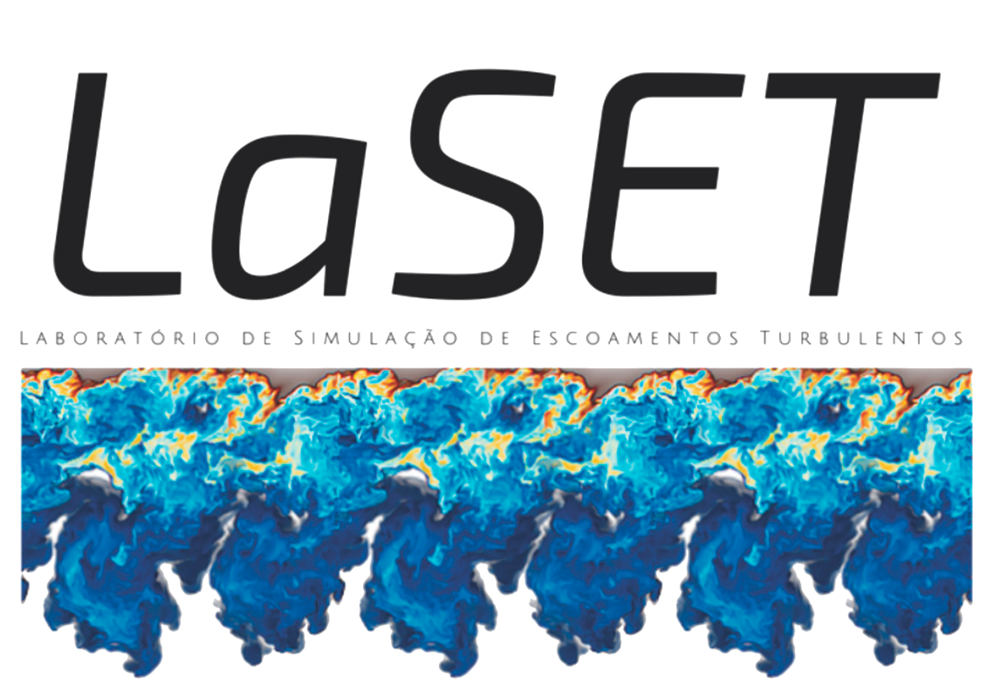
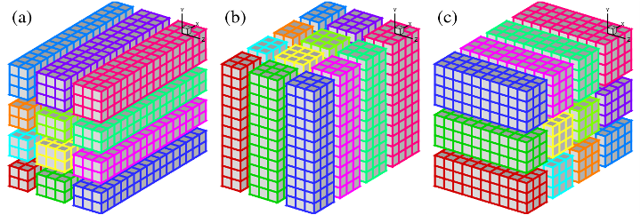
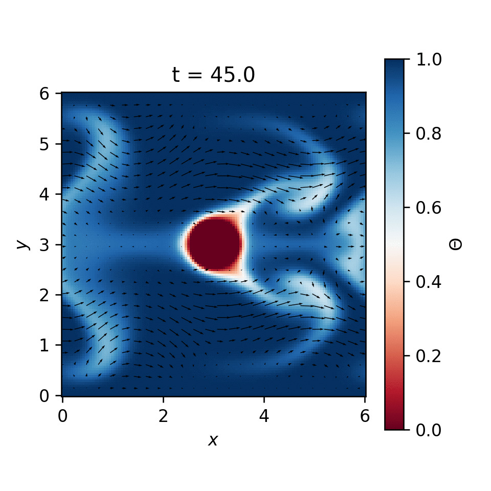
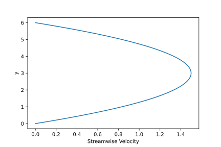
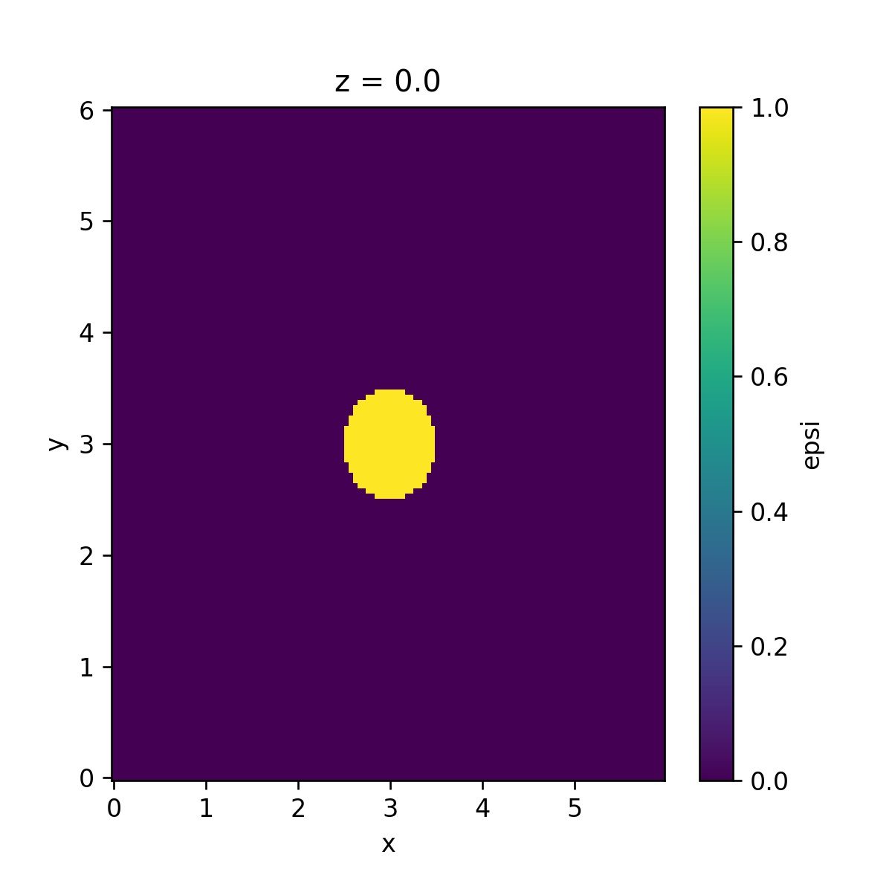
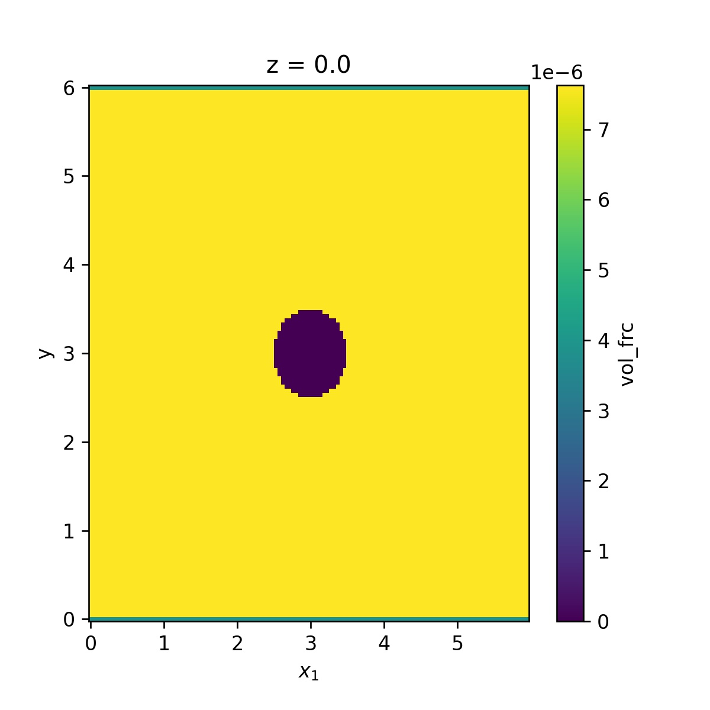
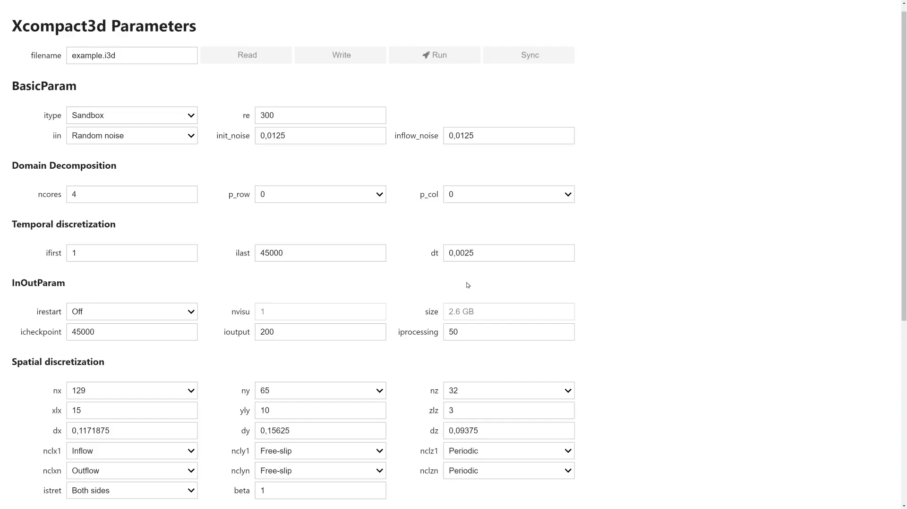

### Sandbox flow configuration: A rapid prototyping tool inside XCompact3d

<div class="animations">
  
</div>

**Felipe N. Schuch**_, LaSET, School of Technology, PUCRS._





- Hi, my name is Felipe;
- I'm glad to be here today **REPRESENTING** our LAB;
- LaSET is the CFD LAB here at PUC rio grande do sul,
- And this is our work: Sandbox flow configuration: A rapid prototyping tool inside XCompact3d


---

# Motivation


- Starting with the motivation for this work, there are two main points to highlight


---

* How can we speed up our workflow?

  

* Can we improve the learning curve for beginners in our code?


- The first is:
  - How can we speed up our workflow?
  - I mean, the iterations here the scientific PROCESS;
  - But more specifically, How can we speed up the iterations here in the simulation cycle.

- and the second point:
  - Can we improve the learning curve for beginners in our code?
  - And especially, how to help them to **code new** flow configurations, going beyond the benchmark cases.


---

### Identifying the main challenges

- Using parallel computation in a distributed-memory system and Message Passing Interface;



<small> _Illustration of the 2D domain decomposition from [2DECOMP&FFT](http://www.2decomp.org/decomp.html)._ </small>

- Coding, compiling, testing, debugging and handling I/O in Fortran.


- This leads us to identify the main challenges in our workflow, if we want to make it easier for beginners and faster for developers;
- I would say, the PARALLEL DECOMPOSITION **IS GREAT** for performance and scalability, but it takes a while to master allocation, transpositions and all the MPI calls;
- Besides that, coding, compiling, testing, debugging and handling I/O in Fortran is not so easy, it is another point that we would like to improve.


---

# Methodology


- The PROBLEMS WERE identified, now, lets see how to solve them!


---

Sandbox Flow Configuration ([BC-Sandbox.f90](https://github.com/fschuch/Xcompact3d/blob/master/src/BC-Sandbox.f90))

<!--  -->


- The initial set-up is imported from external files;
- The choice of the external tool is up to the user:
  - Fortran, Matlab, Octave;
  - Python with just [Numpy](https://numpy.org/) or more specific tools ([Py4Incompact3D](https://github.com/xcompact3d/Py4Incompact3D) or [Xcompact3d-toolbox](https://github.com/fschuch/xcompact3d_toolbox));
- It adds no extra dependency to the workflow.


- This is the Sandbox Flow configuration.
- Of course, xcompact3d already reads the PARAMETERS FILE at initialization, but with the new `MODULE SANDBOX`, the entire initial set-up can be imported from the disk;
- Using it, we can customize any new flow configuration with no need to RECOMPILe the code every time.
- The initial set-up includes case specific definitions, like: Initial condition; Boundary conditions; Geometry; Others.
- It can be provided EXTERNALLY.
- We wanted to keep it simple, so, the choice of what to use is **totally** up to the user:
  - It can be Fortran, Matlab, Python, and many others, as long as you can write binary arrays in the same fashion that xcompact3d would do.
- And here we have a good point: This framework can speed up our workflow, and at the same time, there is no extra **DEPENDENCIES** to install.


---

### Variables handled by `Sandbox`

- Initial condition for velocity and scalar field(s);
- Inflow profiles for velocity and scalar field(s) (if `nclx1=nclxS1=2`);
- Top and bottom boundary values for scalar field(s) (if `nclyS1=2` or `nclySn=2`);
- Customized operator for the imposition of constant flow rate (if `nclx1=nclxn=0`);
- $\epsilon$ array, describing the solid geometry for IBM (if `iibm $\ne$ 0`).

<small>See [README](https://github.com/fschuch/Xcompact3d/blob/master/examples/Sandbox/README.md) for more details.</small>


- Here we see what we can do with sandbox:
  - We should always specify the initial condition for velocity and the scalar fields;
But the other arrays are just demanded in specific situations:
  - Like, we can specify inflow profiles for velocity and scalar if we use Dirichlet boundary condition where x is equals to 0;
  - We can also set scalar values at the bottom and top boundaries if we use Dirichlet;
  - We can specify a customized operator if we want to impose a constant flow rate in a periodic flow;
  - And we set a `epsilon` array if using Immersed Boundary Method.



---

### An example using Python and Numpy

```python
import numpy as np

ux = np.zeros(shape=(nx, ny, nz), dtype=np.float64)
uy = np.zeros_like(ux)
uz = np.zeros_like(ux)
phi = np.zeros(shape=(nx, ny, nz, numscalar), dtype=np.float64)

# Sequence of operations to set the initial condition

ux.T.tofile('./data/ux.bin')
uy.T.tofile('./data/uy.bin')
uz.T.tofile('./data/uz.bin')
for n in range(numscalar):
    phi[:,:,:,n].T.tofile('./data/phi{}.bin'.format(n+1))
```

<small>**Note**: The initial set-up can be provided from any other language, as long as the files are written as raw binaries (compatible with [2DECOMP&FFT](http://www.2decomp.org/)) and the filenames are correct.</small>


- Here is an example of how to set the initial condition in Python with Numpy;
- We initialize the arrays with the right shape and data type;
- Then, we take advantage of Python's flexibility and readability to set the values for our flow configuration; Besides, we can combine with other tools to plot, compute and test our set-up.
- And finally, we write them to the disk, so they will be available for the `module sandbox`.



---

### Cases Covered by `Sandbox`

| Case | IC | BC | FRC | IBM | LMN |
| ---- |:--:|:--:|:---:|:----|:---:|
| Channel-Flow | :heavy_check_mark: | | :heavy_check_mark: | | |
| Cylinder | :heavy_check_mark: |  :heavy_check_mark: | |  :heavy_check_mark: | |
| Lock-exchange | :heavy_check_mark: | :heavy_check_mark: | | | :warning: |
| Periodic Hill | :heavy_check_mark: | | :heavy_check_mark: | :heavy_check_mark: | |
| Taylor–Green vortex | :heavy_check_mark: | | | | |
| TBL | :heavy_check_mark: | :warning: | :warning: | | |

<small>**Note**: Initial Condition (**IC**); Boundary Conditions (**BC**); Flow rate Control (**FRC**); Immersed Boundary Method (**IBM**); Low Mach Number (**LMN**).</small>


- Here we see an estimation of the cases covered by sandbox at this moment;
- We can simulate Channel-flow, flow around a cylinder, Periodic Hill and TGV;
- Density current in the lock-exchange will work too, as long as we are not using the low mach number approach, it was not implemented in the module yet;
- And the turbulent boundary layer demands more specific definitions of boundary conditions and flow rate control, so it is also not supported.
- But, like I told you, it is just an estimation, because now we can play around and modify any of these cases.


<!-- ---

### It supports Initial Condition

| Filename    | Shape | Demanded |
| ----------- | ------| -------- |
| `ux.bin`    | (nx, ny, nz) | always |
| `uy.bin`    | (nx, ny, nz) | always |
| `uz.bin`    | (nx, ny, nz) | always |
| `phi<n>.bin` | (nx, ny, nz) | `numscalar $>$ 0` |

---

### It supports Boundary Condition

| Filename    | Shape | Demanded |
| ----------- | ------| -------- |
| `bxx1.bin` | (ny, nz) | `nclx1=2` |
| `bxy1.bin` | (ny, nz) | `nclx1=2` |
| `bxz1.bin` | (ny, nz) | `nclx1=2` |
| `bxphi1<n>.bin` | (ny, nz) | `nclxS1=2` |
| `byphi1<n>.bin` | (nx, nz) | `nclyS1=2` |
| `byphin<n>.bin` | (nx, nz) | `nclySn=2` |


---

### It supports other arrays

| Filename    | Description | Demanded |
| ----------- | ----------- | -------- |
| `geometry.bin` | $\epsilon$ array set to 1 inside the solid and zero otherwise | `iibm $\ne$ 0` |
| `vol_frc.bin` | Customized operator to impose constant flow rate | `nclx1=nclxn=0` |

--- -->

---

# Case Study


- For example, we are going to **merge** the periodic channel and the flow around a cylinder...


---

### Periodic Heat Exchanger



- Periodic boundary conditions in x and z;
- A cylinder at the center with low temperature;
- No-slip conditions for velocity at top and bottom, besides, high temperature at the walls.


- Besides combining it with HEAT TRANSFER, in what I called, **The Period Heat Exchanger**.
- We have periodic boundary conditions in the streamwise and spanwise directions;
- A cylinder at the center of the domain with its dimensionless temperature fixed at zero;
- And no-slip BC at the bottom and top walls, and their temperature fixed in one.
- Lets see how to code it!


---

### Initialization

```python
>>> import xcompact3d_toolbox as x3d
>>> import xcompact3d_toolbox.sandbox
>>> prm = x3d.Parameters(loadfile='input.i3d')
>>> dataset = x3d.sandbox.init_dataset(prm)
>>> dataset
```
```text
<xarray.Dataset>
Dimensions:  (n: 1, x: 128, y: 129, z: 8)
Coordinates:
  * x        (x) float64 0.0 0.04688 0.09375 0.1406 ... 5.812 5.859 5.906 5.953
  * y        (y) float64 0.0 0.04688 0.09375 0.1406 ... 5.859 5.906 5.953 6.0
  * z        (z) float64 0.0 0.04688 0.09375 0.1406 0.1875 0.2344 0.2812 0.3281
  * n        (n) int32 0
Data variables:
    byphi1   (n, x, z) float64 0.0 0.0 0.0 0.0 0.0 0.0 ... 0.0 0.0 0.0 0.0 0.0
    byphin   (n, x, z) float64 0.0 0.0 0.0 0.0 0.0 0.0 ... 0.0 0.0 0.0 0.0 0.0
    ux       (x, y, z) float64 0.0 0.0 0.0 0.0 0.0 0.0 ... 0.0 0.0 0.0 0.0 0.0
    uy       (x, y, z) float64 0.0 0.0 0.0 0.0 0.0 0.0 ... 0.0 0.0 0.0 0.0 0.0
    uz       (x, y, z) float64 0.0 0.0 0.0 0.0 0.0 0.0 ... 0.0 0.0 0.0 0.0 0.0
    phi      (n, x, y, z) float64 0.0 0.0 0.0 0.0 0.0 ... 0.0 0.0 0.0 0.0 0.0
    vol_frc  (x, y, z) float64 0.0 0.0 0.0 0.0 0.0 0.0 ... 0.0 0.0 0.0 0.0 0.0
```


- I'm using xcompact3d-toolbox just because I'm more familiar with it;
- We start here importing the Package;
- Lets say that we already had set all the correct parameters at the input file, so now we load it;
- And we start the dataset. It is returned to us with the proper dimensions, coordinates and the SEVEN data variables that we are going to work with now


---

### Boundary Conditions

High temperature at the bottom and top walls:

$$
\Theta(x,y=0,z,t) = 1
$$

$$
\Theta(x,y=L_y,z,t) = 1
$$

```python
>>> dataset["byphi1"] += 1.0
>>> dataset["byphin"] += 1.0
```

- We start setting the temperature as one at the bottom and top walls, like specified for our new flow configuration;


---

### Initial Condition



```python
>>> dataset["ux"] += velocity_profile + random_noise
>>> dataset["uy"] += random_noise
>>> dataset["uz"] += random_noise
>>> dataset["phi"] += 1.0
```

<small>**Note:** Part of the code was not presented, for simplicity.</small>


- Now, lets set the initial condition for the streamwise velocity as this vertical profile in addition to some random noise, and just random noise for uy and uz;
- And the initial temperature will be one everywhere.


---

### Geometry

```python
>>> epsi = x3d.sandbox.init_epsi(prm)
>>> for array in epsi.values():
...     array = array.geo.cylinder(x=prm.xlx / 2.0, y=prm.yly / 2.0)
...
>>> epsi["epsi"].isel(z=0).plot()
```




- Now it is time to set the geometry, a cylinder in the center of the domain.
- Notice that xcompact3d-toolbox includes methods to draw many standards geometries.
- Here we are using the cylinder, we just have to specify its center and we are good to go.


---

### Flow rate Control

```python
>>> dataset["vol_frc"] += prm.dy / prm.yly / prm.nx / prm.nz
>>> dataset["vol_frc"][dict(y=0)] *= 0.5
>>> dataset["vol_frc"][dict(y=-1)] *= 0.5
>>> dataset["vol_frc"] = dataset.vol_frc.where(epsi == False, 0.0)
>>> dataset.vol_frc.isel(z=0).plot()
```




- Since the domain is periodic in x, we need to specify a forcing term to maintain a constant flow rate,
and actually, we can specify a customized operator for the volumetric integration.
- This one will give us a unitary value per **HEIGHT** unit, and will include an average in x and z.
- We multiply both top and bottom plane by half because of the composed trapezoidal rule for integration;
- And of course, we can disconsider the cylinder when integrating.


---

- Now we save the arrays to the disk:
  ```python
  >>> dataset.x3d.write(prm)
  >>> x3d.gene_epsi_3D(epsi, prm)
  ```
- And run the simulation:
  ```bash
  mpirun -n [number of cores] ./xcompact3d |tee log.out
  ```
- There is no need to recompile the code every time;
- We can code, test, plot and debug the initial set-up interactively in a [Jupyter Notebook](https://jupyter.org/) (or any other computational tool).


- Now it is time to write all the variables to the disk and run the simulation;
- Notice that there is no need to recompile the code every time;
- And we can code, test, plot and debug the initial set-up using any computational tool, like a Jupyter Notebook, and make it very interactive;


---


Periodic Heat Exchanger

<div class="animations">
  
</div> 

<small>[View the code online](https://xcompact3d-toolbox.readthedocs.io/en/latest/examples/Heat-exchanger.html).</small>


- Here we see an animation of the case that we just coded, the periodic heat exchanger;
- I have a few more examples to show to you


---

<div class="animations">
  
</div> 

<small>[View the code online](https://xcompact3d-toolbox.readthedocs.io/en/latest/examples/Axisymmetric_flow.html).</small>


- We are looking in a top view, that is presenting the depth-averaged concentration of the turbidity current in asymmetric configuration.
- This one is just like Ricardo explained to us earlier in HIS talk,
- but this time the denser fluid starts here at the bottom left corner and can spread in more directions.
- We can se the lobes-and-clefts near the front, how some rings are formed in the body and them they break down, and many other nice features.


---

<div class="animations">
  
</div> 

<small>[View the code online](https://xcompact3d-toolbox.readthedocs.io/en/latest/examples/Square.html).</small>


- End the last example is the flow around a square with passive scalar as a visualization tool.
- Here at the inlet we have this smooth step function for the passive scalar, as a result, we can see this nice pattern downstream due to the turbulence;
- As always, everything is very CUSTOMIZABLE. We could change the position of the square, we could include more squares; change the number os steeps here at the inlet;
- You can see the complete code here in this link, and you can access the slides using the QR code at the end of this talk.


---

# Bonus


- And I have a special bonus for you


---

User Interface with IPywidgets ([try it online](https://xcompact3d-toolbox.readthedocs.io/en/latest/tutorial/parameters.html#))

<div class="animations">
  
</div> 

<!-- <small>[Try it online](https://xcompact3d-toolbox.readthedocs.io/en/latest/tutorial/parameters.html#).</small> -->


- I've talked about improving the learning curve for beginners in our code, and here is another initiative.
- We have this user interface with IPywidgets under development in our LAB;
- Using it, we can enforce the right relationship between the parameters, just to make sure they are compatible with xcompact3d;


---

# Conclusion

---

### The outcome of this work benefits users from different levels:

- **For students in CFD**, it provides **direct hands-on experience** and a safe place for practising and learning;
- **For advanced users** and code developers, it works as a **rapid prototyping tool**;
- Furthermore, it is a useful advance in terms of **research reproducibility**.

<small>**Note:** `module sandbox` is still in pre-release ([fschuch/Xcompact3d](https://github.com/fschuch/Xcompact3d)).</small>


- To conclude this talk, we **EXPECT** to help **USER** from different levels with our framework;
  - **For students in CFD**, it provides **direct hands-on experience** and a safe place for practising and learning;
  - **For advanced users** and code developers, it works as a **rapid prototyping tool**;
  - Furthermore, it is a useful advance in terms of **research reproducibility**, because now it is easier to create, collaborate and share any new flow configuration.


---

# Questions?


> <small>**Felipe N. Schuch**, LaSET, School of Technology, PUCRS.<br></small>
> <small>:house: [fschuch.com](www.fschuch.com/en) :envelope: felipe.schuch@edu.pucrs.br</small>


<!-- <small>www.fschuch.com/en/slides/2021-x3d-showcase</small> -->


- That is it, tank you very much for your ATTENTION;
- I'm ready to take any questions now.
